# How each flow works

The algorithm behind every flow that has one, said four ways: a flow chart,
pseudocode, the reasoning, and where to read more. The same guides are in the
studio: open a flow and press **How it works**.

*Generated from `packages/shared/src/registry/guides/` by `npm run docs:flows`.*

## Contents

- Line Detection — Finding lines: two sharp changes, close together, along a stroke
- Image Crop — Cropping: a box drawn by hand, or the smallest box round the solid pixels
- Image Resize — Resizing: resampling through a kernel, across and then down
- Color Palette — A palette by counting: the commonest colours, kept apart
- Palette Filter — Filtering against a palette: keep what matches, or snap everything to it
- Image Extraction — Cutting out: fills, cuts and regions replayed into a mask
- Video Background — A background from a video: each pixel’s most common colour
- Shot Split — Finding cuts: compare samples, then binary-search each cut to the frame
- Video Edit — Editing a video: segments, a crop, and recording by playing it through
- Video Source — Bringing a video in: checked by its bytes, fetched safely
- Rig Match — Finding a rigged body in a picture, by small features
- Video Rig Match — A rig animation from a video: Rig Match on every sampled frame
- Animatic — An animatic: the board’s panels timed into a cut
- Polygon Decomposition — Turning a picture into shapes: edges, fills, outlines, then lines
- Vector Editor — Editing shapes: anchors that are the truth, curves derived from them
- Line Graph — Lines as a graph: fill, thin to the middle, trace between nodes
- Skeletal Rig — A skeleton, and a preview of it moving under forces
- Rig Binding — Binding a drawing to a skeleton, node by node
- Pose — Posing: angles down the tree (FK), and dragging a hand to a target (IK)
- Rig Parts — Taking a bound drawing apart: each shape to the bone most of it follows
- Face Parts — Finding the features of a face from where shapes sit, their size, shape and colour
- Corpus — Gathering text into one body
- Word Database — Counting words, and the company they keep
- Dictionary — Asking a dictionary, and applying the answers
- Grammar Database — Sentence shapes, counted
- Random Text — Writing one word at a time
- Timeline — Partial times, laid out in lanes
- World Map — Terrain from noise, climate from latitude
- Storyboard — A board from a script, merged without losing sketches

## Line Detection

**Finding lines: two sharp changes, close together, along a stroke** · `art.lines`

A drawn line is a narrow band of its own colour with a sharp change into it and a sharp change out of it. Walking across the picture in four directions, every run of one colour is tested for exactly that; the pixels that pass are joined into patches, and a patch only counts if it is several times longer than it is wide. Each line pixel gets a confidence from how sharp its edges are and how far past that ratio its patch reaches, and a width from the narrowest walk across it.

### The steps

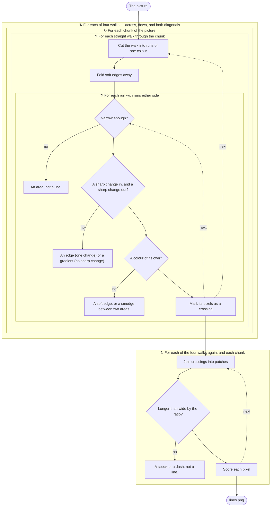
```mermaid
flowchart TD
  s1(["The picture"])
  subgraph s2["↻ For each of four walks — across, down, and both diagonals"]
    subgraph s3["↻ For each chunk of the picture"]
      subgraph s4["↻ For each straight walk through the chunk"]
        s5["Cut the walk into runs of one colour"]
        s6["Fold soft edges away"]
        s5 --> s6
        subgraph s7["↻ For each run with runs either side"]
          s8{"Narrow enough?"}
          s9["An area, not a line."]
          s8 -- no --> s9
          s10{"A sharp change in, and a sharp change out?"}
          s11["An edge (one change) or a gradient (no sharp change)."]
          s10 -- no --> s11
          s8 --> s10
          s12{"A colour of its own?"}
          s13["A soft edge, or a smudge between two areas."]
          s12 -- no --> s13
          s10 --> s12
          s14["Mark its pixels as a crossing"]
          s12 --> s14
        end
        s14 -. next .-> s8
        s6 --> s8
      end
      s14 -. next .-> s5
    end
  end
  s1 --> s5
  subgraph s15["↻ For each of the four walks again, and each chunk"]
    s16["Join crossings into patches"]
    s17{"Longer than wide by the ratio?"}
    s18["A speck or a dash: not a line."]
    s17 -- no --> s18
    s16 --> s17
    s19["Score each pixel"]
    s17 --> s19
  end
  s19 -. next .-> s16
  s14 --> s16
  s20(["lines.png"])
  s19 --> s20
```

- *In:* The picture — Every pixel, as red, green, blue and opacity.
- **↻ For each of four walks — across, down, and both diagonals**
  - **↻ For each chunk of the picture** — Chunk × chunk pixels, read with a margin round it so a line on the border still has its colours either side.
    - **↻ For each straight walk through the chunk**
      - Cut the walk into runs of one colour — A run ends where the next pixel jumps by the Sharp change or more, or where the colour has drifted more than the Flatness from the run’s average.
      - Fold soft edges away — A run of 1–2 pixels whose colour lies between its neighbours’ is anti-aliasing: it joins the edge it softens.
      - **↻ For each run with runs either side**
        - **Narrow enough?** — No wider than Widest line. *If not:* An area, not a line.
        - **A sharp change in, and a sharp change out?** *If not:* An edge (one change) or a gradient (no sharp change).
        - **A colour of its own?** — Not a blend of the colours either side, and at least the Sharp change away from each. *If not:* A soft edge, or a smudge between two areas.
        - Mark its pixels as a crossing — With its width across, and the softer of its two edges.
- **↻ For each of the four walks again, and each chunk**
  - Join crossings into patches — 8-connected neighbours of the same colour, reaching up to half a chunk past the chunk.
  - **Longer than wide by the ratio?** — Length along the line ÷ mean width. *If not:* A speck or a dash: not a line.
  - Score each pixel — ½ × sharpness + ½ × reach, and at least 20%. Keep the best score and the narrowest width over the four walks.
- *Out:* lines.png — Black where there is no line; red for thin, blue for wide; brighter the surer.

### Pseudocode

```
for each walk direction d in [across, down, ↘, ↗]:
  crossings_d = empty map                   # pixel → (width, sharpness)
  for each chunk c:
    for each straight walk w through (c + margin) in direction d:
      runs = cut w where |step| >= contrast or |pixel - run.mean| > flatness
      runs = fold runs of 1–2 px that are a blend of their neighbours
      for each run r with a run before (b) and after (a):
        if width(r) > maxWidth:                 continue   # an area
        if not sharp(b→r) or not sharp(r→a):    continue   # an edge or a gradient
        if isBlend(b, r, a):                    continue   # a soft edge
        if dist(r, b) < contrast or dist(r, a) < contrast: continue
        for p in r inside c:
          crossings_d[p] = (width(r), min(sharp(b→r), sharp(r→a)))

  for each chunk c:
    for each patch P of crossings_d in c        # 8-connected, same colour,
                                                # reaching half a chunk past c
      ratio = length_along_line(P) / mean_width(P)
      if ratio < minRatio: continue             # a speck, not a stroke
      for p in P inside c:
        sharpness = min(1, crossings_d[p].sharp / (contrast * 2.5))
        reach     = min(1, ratio / (minRatio * 2))
        score     = max(0.2, 0.5 * sharpness + 0.5 * reach)
        confidence[p] = max(confidence[p], score)
        width[p]      = min(width[p], crossings_d[p].width * stepLength(d))
```

### What makes a line a line

Look across a drawn line and the colour does three things: it is one colour, it changes **sharply** to the line's colour, and a few pixels later it changes **sharply** again to the colour beyond. Everything else that is not a line fails one of those:

- **An edge** — sky meeting grass — has one change, not two.
- **A gradient** changes a little at every pixel, never sharply.
- **A soft edge** has a pixel or two part-way between the colours either side. That pixel is a *blend*, not a colour of its own, so it is folded into the edge it softens; otherwise every anti-aliased edge would look like a one-pixel line.
- **A speck** or a short dash can pass all of that, which is why the last test is about shape: a line is longer than it is wide.

### Why four walks

A walk only sees a line it crosses. Walking left to right crosses upright lines; walking down crosses flat ones; the diagonal walks cross lines at 45°. Each pixel keeps the **best** score any walk gave it, and the **narrowest** width, because the narrowest crossing is the one most nearly straight across the line. A diagonal step is √2 pixels long, so widths and lengths from the diagonal walks are scaled by √2.

### Runs, jumps and drift

A walk is cut into runs of one colour. A run ends in one of two ways:

- a **jump**: the next pixel differs from this one by at least the **Sharp change** — that is the "sharp change" a line needs on each side;
- a **drift**: the pixel has wandered more than the **Flatness** from the run's average colour, without any single jump. This is how a gradient becomes a string of runs with no sharp change between them, so none of them can be a line.

Colour differences are measured over red, green, blue and opacity together, scaled so black against white is 100.

### Longer than wide

The crossings a walk found are joined into **patches**: neighbouring pixels (including diagonal neighbours) that were crossings and are the same colour. A patch's length is measured *along* the line — for the walk across, that is up and down — and its width is the average width of its crossings. The patch must be at least **Longer than wide by** times longer than it is wide. The patch may reach half a chunk beyond its own chunk, so a line crossing a chunk border is not measured short.

### The confidence

A line pixel's confidence from one walk is half **sharpness** and half **reach**:

- sharpness = the softer of its two edges ÷ (2.5 × Sharp change), at most 1 — an edge two and a half times the least that counts is as sharp as it gets;
- reach = the patch's ratio ÷ (2 × the ratio needed), at most 1 — a line twice as long for its width as it needs to be is as long as it gets.

It is never below 20% once the pixel has passed every test, so a faint but real line still shows.

### Chunks

The picture is read in square chunks, each with a margin of the widest line plus three pixels, so the colours either side of a line on the border are seen. Chunks keep each walk short and local: a walk across a whole large picture would see so many colours that a small line could be merged into something far away.

### What it gets wrong

- A line drawn with a soft brush, fading in over several pixels, has no sharp change: raise **Flatness** and lower **Sharp change**, or it is not found.
- Two lines closer together than their width are read as one wider line.
- A thin area between two others — a narrow stripe of a pattern — is a line by this definition, because it is one.

### Settings

| Setting | What it changes |
| --- | --- |
| Sharp change | The least jump between two neighbouring pixels that counts as a sharp change. Lower finds fainter lines, and takes in more texture. |
| Flatness | How far a pixel may drift from its run’s average colour and stay in the run. Higher lets a line with a little shading stay one run; too high merges a gradient into one run. |
| Widest line | The widest run that can be a line. Wider is an area. |
| Longer than wide by | How many times longer than wide a patch must be. Higher drops dashes and specks; too high drops short strokes. |
| Chunk size | The side of the squares the picture is read in. Smaller is more local; a line must still fit its length within about a chunk and a half. |

**Cost:** Each pixel is visited once per walk (four times) for the runs, and again when patches are joined: time grows with the number of pixels. A million pixels take well under a second.

**Try it:** Turn on **Explain a pixel** over the picture and click any pixel: the detection is run again with a note kept of it, and every walk, run, test and number is shown.

### Further reading

- [Edge detection](https://en.wikipedia.org/wiki/Edge_detection) — The classic problem this is a variation on: here an edge alone is exactly what is not wanted.
- [Ridge detection](https://en.wikipedia.org/wiki/Ridge_detection) — Finding thin bright or dark bands — the same idea, done with image derivatives instead of runs.
- [Run-length encoding](https://en.wikipedia.org/wiki/Run-length_encoding) — Cutting a row of pixels into runs of one value, which is the first step of each walk.
- [Connected-component labelling](https://en.wikipedia.org/wiki/Connected-component_labeling) — How crossings are joined into patches (8-connectivity).
- [Spatial anti-aliasing](https://en.wikipedia.org/wiki/Spatial_anti-aliasing) — Why soft edges have blended pixels, and so why blends are folded away.

*Code:* `packages/shared/src/flows/lines.ts — detectLines, explainLinePixel, crossingChecks, isBlend`

## Image Crop

**Cropping: a box drawn by hand, or the smallest box round the solid pixels** · `art.crop`

By hand, the box is the one drawn, kept inside the picture. To the solid pixels, every row is scanned for its first and last pixel more opaque than a threshold; the smallest box holding all of them is the crop, with an optional margin and an optional growth to a square. What the box reaches past the picture is clear.

### The steps

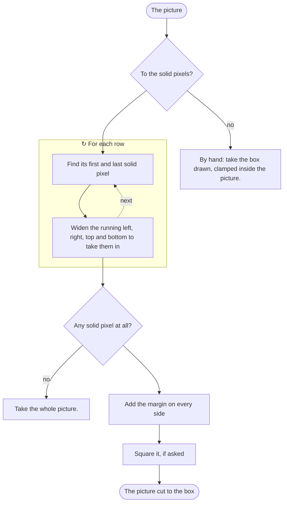
```mermaid
flowchart TD
  s1(["The picture"])
  s2{"To the solid pixels?"}
  s3["By hand: take the box drawn, clamped inside the picture."]
  s2 -- no --> s3
  s1 --> s2
  subgraph s4["↻ For each row"]
    s5["Find its first and last solid pixel"]
    s6["Widen the running left, right, top and bottom to take them in"]
    s5 --> s6
  end
  s6 -. next .-> s5
  s2 --> s5
  s7{"Any solid pixel at all?"}
  s8["Take the whole picture."]
  s7 -- no --> s8
  s6 --> s7
  s9["Add the margin on every side"]
  s7 --> s9
  s10["Square it, if asked"]
  s9 --> s10
  s11(["The picture cut to the box"])
  s10 --> s11
```

- *In:* The picture
- **To the solid pixels?** *If not:* By hand: take the box drawn, clamped inside the picture.
- **↻ For each row**
  - Find its first and last solid pixel — Solid: opacity above Solid above.
  - Widen the running left, right, top and bottom to take them in
- **Any solid pixel at all?** *If not:* Take the whole picture.
- Add the margin on every side — It may reach past the picture: that part is clear.
- Square it, if asked — The short side grows about the box’s middle.
- *Out:* The picture cut to the box — Pixels outside the picture are (0, 0, 0, 0).

### Pseudocode

```
if mode == manual:
  box = clamp(drawn_box or whole_picture, inside picture)
else:                                         # to the solid pixels
  left, right, top, bottom = +inf, -1, +inf, -1
  for y in rows:
    xs = [x for x in row y if alpha(x, y) > threshold]
    if xs: left = min(left, xs.first); right = max(right, xs.last)
           top = min(top, y);          bottom = y
  box = (left, top, right - left + 1, bottom - top + 1) or whole_picture
  box = box grown by margin on every side      # may go past the edge
if square: grow the short side about the middle
out = new picture of box size, all clear
copy the part of the picture inside box into out
```

### Why a scan and not a search

The smallest box round the solid pixels is set by only four pixels — the leftmost, rightmost, topmost and bottommost solid ones. One pass over every row, keeping the first and last solid pixel of each, finds them all; nothing cleverer is needed, and nothing faster is possible without skipping pixels.

### Solid, and the threshold

A pixel counts when its opacity is above **Solid above** (0–254). At 0 any pixel that is not completely clear counts, including the faint halo anti-aliasing leaves round a cut-out; raise it to ignore that halo, or a stray almost-invisible speck far from the subject.

### Past the edge

The margin and the squaring can take the box past the picture. That part of the result is clear — `(0, 0, 0, 0)` — so a subject can be centred in a square with room round it even when it touches the picture’s edge.

### Settings

| Setting | What it changes |
| --- | --- |
| Solid above | The opacity a pixel must be above to count as part of the subject. |
| Margin | Clear pixels kept round the solid box on every side. |
| Square | Grow the short side so the box is square, about its middle. |

**Cost:** One pass over the pixels.

### Further reading

- [Minimum bounding box](https://en.wikipedia.org/wiki/Minimum_bounding_box) — The axis-aligned box round a set of points, which is what the solid crop is.
- [Alpha compositing](https://en.wikipedia.org/wiki/Alpha_compositing) — What opacity (alpha) is, and why a cut-out has a faint halo.

*Code:* `packages/shared/src/flows/crop.ts — opaqueBounds, cropRectFor, squared, cropBitmap`

## Image Resize

**Resizing: resampling through a kernel, across and then down** · `art.resize`

Each pixel of the new picture sits somewhere between pixels of the old one. Its colour is a weighted average of the old pixels near that spot, the weights given by a kernel — one pixel (nearest), a straight-line ramp (bilinear), a Catmull-Rom curve (bicubic) or a windowed sinc (Lanczos). It is done in two passes, across then down, with colours premultiplied by opacity, and when shrinking the kernel is widened so every old pixel is counted.

### The steps

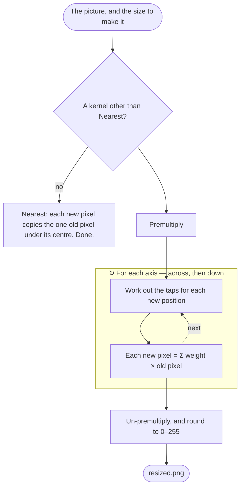
```mermaid
flowchart TD
  s1(["The picture, and the size to make it"])
  s2{"A kernel other than Nearest?"}
  s3["Nearest: each new pixel copies the one old pixel under its centre. Done."]
  s2 -- no --> s3
  s1 --> s2
  s4["Premultiply"]
  s2 --> s4
  subgraph s5["↻ For each axis — across, then down"]
    s6["Work out the taps for each new position"]
    s7["Each new pixel = Σ weight × old pixel"]
    s6 --> s7
  end
  s7 -. next .-> s6
  s4 --> s6
  s8["Un-premultiply, and round to 0–255"]
  s7 --> s8
  s9(["resized.png"])
  s8 --> s9
```

- *In:* The picture, and the size to make it
- **A kernel other than Nearest?** *If not:* Nearest: each new pixel copies the one old pixel under its centre. Done.
- Premultiply — Red, green and blue are multiplied by opacity, so a clear pixel’s colour weighs nothing.
- **↻ For each axis — across, then down**
  - Work out the taps for each new position — Its centre in old pixels = (i + 0.5) ÷ scale − 0.5; the kernel weighs each old pixel within its radius (times 1 ÷ scale when shrinking); the weights are made to add up to 1.
  - Each new pixel = Σ weight × old pixel
- Un-premultiply, and round to 0–255
- *Out:* resized.png

### Pseudocode

```
kernel = { bilinear: tent(radius 1), bicubic: catmull_rom(radius 2),
           lanczos: sinc(x) * sinc(x / 3) (radius 3) }

def taps(from_len, to_len):
  scale  = to_len / from_len
  spread = 1 / scale if scale < 1 else 1          # shrink: widen the kernel
  for i in 0 .. to_len-1:
    centre = (i + 0.5) / scale - 0.5
    js = old positions within kernel.radius * spread of centre
    w[j] = kernel((j - centre) / spread) for j in js
    normalise w to sum 1

src = premultiply(picture)                          # rgb *= alpha
tmp = for each row:    new[x] = Σ w_x[j] * src[j]     # across
out = for each column: new[y] = Σ w_y[j] * tmp[j]     # down
return unpremultiply(out)
```

### The kernels

- **Nearest** takes the single old pixel under the new one's centre. Blocky — and exactly right for pixel art, where each pixel is a deliberate mark.
- **Bilinear** weighs the two nearest old pixels each way by how close they are (a tent). Soft.
- **Bicubic** uses the Catmull-Rom curve over four pixels each way. It passes exactly through the old pixels and keeps edges crisper than bilinear, with little ringing: the default for drawings.
- **Lanczos** uses sinc(x)·sinc(x/3) over six pixels each way: the sharpest, and it can leave a faint light or dark ring beside a hard edge.

### Two passes

Every kernel here is separable: weighing a square of pixels is the same as weighing across and then weighing down. Two passes of k taps cost 2k per pixel instead of k², which is the difference between instant and slow for Lanczos.

### Shrinking

Shrinking to a quarter with a kernel two pixels wide would read only one old pixel in four, and a thin line could vanish or flicker depending on where it fell. So when shrinking the kernel is stretched by as much as the picture shrinks: every old pixel contributes to some new one, which is proper area averaging.

### Premultiplied colour

A clear pixel has colour numbers too — often black. Averaged as they are, that black bleeds into the edge of a shape as a dark fringe. Multiplying each colour by its opacity first means a clear pixel contributes nothing to the colour, only to the opacity; dividing back afterwards restores the colour of what was actually there.

### Settings

| Setting | What it changes |
| --- | --- |
| Scale / size | The new size: by a factor, or in pixels (with the height following the width when the shape is kept). |
| Method | The kernel: Nearest, Bilinear, Bicubic or Lanczos. |

**Cost:** New pixels × kernel taps, twice (once per pass). Lanczos is about three times the work of bilinear.

### Further reading

- [Image scaling](https://en.wikipedia.org/wiki/Image_scaling) — An overview of the methods and their artefacts.
- [Bicubic interpolation](https://en.wikipedia.org/wiki/Bicubic_interpolation) — Including the Catmull-Rom (a = −0.5) kernel used here.
- [Lanczos resampling](https://en.wikipedia.org/wiki/Lanczos_resampling) — The windowed-sinc kernel, and why it rings.
- [Premultiplied alpha](https://en.wikipedia.org/wiki/Alpha_compositing#Straight_versus_premultiplied) — Why colours are multiplied by opacity before blending.

*Code:* `packages/shared/src/flows/resize.ts — resizeBitmap, taps, KERNELS, targetSize`

## Color Palette

**A palette by counting: the commonest colours, kept apart** · `art.palette`

Every pixel is counted, with near-identical colours rounded together. The counted colours are then walked from commonest to rarest: each joins the nearest group it is within the minimum distance of (measured in OKLab, where distance matches what the eye sees), or starts a group of its own until the palette is full. Each group is one mode of the picture, and the palette takes one colour from each — its commonest, or with temperature one nudged towards another member.

### The steps

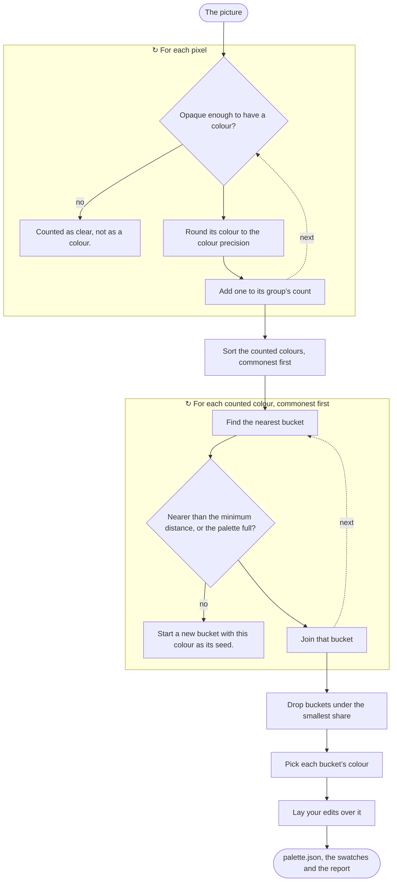
```mermaid
flowchart TD
  s1(["The picture"])
  subgraph s2["↻ For each pixel"]
    s3{"Opaque enough to have a colour?"}
    s4["Counted as clear, not as a colour."]
    s3 -- no --> s4
    s5["Round its colour to the colour precision"]
    s3 --> s5
    s6["Add one to its group’s count"]
    s5 --> s6
  end
  s6 -. next .-> s3
  s1 --> s3
  s7["Sort the counted colours, commonest first"]
  s6 --> s7
  subgraph s8["↻ For each counted colour, commonest first"]
    s9["Find the nearest bucket"]
    s10{"Nearer than the minimum distance, or the palette full?"}
    s11["Start a new bucket with this colour as its seed."]
    s10 -- no --> s11
    s9 --> s10
    s12["Join that bucket"]
    s10 --> s12
  end
  s12 -. next .-> s9
  s7 --> s9
  s13["Drop buckets under the smallest share"]
  s12 --> s13
  s14["Pick each bucket’s colour"]
  s13 --> s14
  s15["Lay your edits over it"]
  s14 --> s15
  s16(["palette.json, the swatches and the report"])
  s15 --> s16
```

- *In:* The picture
- **↻ For each pixel**
  - **Opaque enough to have a colour?** — Opacity above Ignore pixels more transparent than. *If not:* Counted as clear, not as a colour.
  - Round its colour to the colour precision — Only to group it: the group is named after the commonest exact colour in it.
  - Add one to its group’s count
- Sort the counted colours, commonest first
- **↻ For each counted colour, commonest first**
  - Find the nearest bucket — OKLab distance ×100, with opacity as one more side.
  - **Nearer than the minimum distance, or the palette full?** *If not:* Start a new bucket with this colour as its seed.
  - Join that bucket — Its count grows by this colour’s count.
- Drop buckets under the smallest share — Never the first.
- Pick each bucket’s colour — Its seed; with temperature, moved that far towards another member, chosen by how common it is, in OKLab.
- Lay your edits over it — Changed, removed and added colours, kept by the colour they started from.
- *Out:* palette.json, the swatches and the report

### Pseudocode

```
counts = {}
for pixel in picture (every stride-th):
  if alpha(pixel) <= alpha_floor: transparent += 1; continue
  key = round each channel to precision bits
  counts[key].add(pixel)                  # named later by its commonest exact pixel

buckets = []
for colour in sort(counts, by count desc):
  nearest, d = closest bucket to colour   # OKLab distance x100 (+ opacity)
  if nearest and (d < min_distance or len(buckets) >= wanted):
    nearest.members += colour; nearest.count += colour.count
  else:
    buckets += Bucket(seed = colour)

buckets = [b for b in buckets if b is first or b.count >= min_share * total]
palette = [pick(b, temperature) for b in buckets]
# pick: seed at 0; else mix_oklab(seed, member chosen by count, temperature)
apply the edits made by hand
```

### The mode, not the average

Averaging a picture’s colours — as k-means does — gives colours that sit between the real ones: a red jacket against green grass averages towards brown. Counting gives the colours the picture actually uses most. Each palette entry is a colour that really occurs.

### Why a minimum distance

A photograph of a sky has thousands of slightly different blues, and the five commonest are five near-identical blues. So a colour closer than **Minimum distance** to a bucket already started joins it instead of starting another. One bucket is one mode of the picture — one colour family — and its count is the family’s share of the picture.

### OKLab

Distances are measured in OKLab, a colour space built so that equal distances look equally different. In RGB, two dark blues can be far apart in numbers and look the same, while a yellow and a pale green are close in numbers and look different. The scale is ×100: under about 2 is the same colour to the eye; navy to royal blue is about 20; red to green is past 70.

### Rounding, but only for grouping

Colours are rounded to **Color precision** bits a channel before counting — 5 bits is 32 levels — so a photographed wall is one colour rather than thousands. The group is then *named* after the commonest exact colour in it, so the palette never contains a colour that is not in the picture.

### Temperature

At 0 each entry is its bucket’s commonest colour. Above 0 it moves that fraction of the way towards another member of the bucket, picked at random weighted by count (from a fixed seed, so it repeats). The blend is done in OKLab, so it stays within the family instead of greying out.

### Settings

| Setting | What it changes |
| --- | --- |
| Colors | How many buckets can be started: the most entries the palette has. |
| Minimum distance | How far apart (OKLab ×100) two entries must be. Higher gives more distinct colours. |
| Temperature | How far each entry moves from its bucket’s commonest colour towards another member. |
| Color precision | Bits kept per channel when grouping pixels. Lower groups more. |
| Ignore pixels more transparent than | Pixels this clear are counted as clear, not as a colour. |
| Drop groups under | Buckets smaller than this share of the picture are left out. |

**Cost:** One pass over the pixels to count, then distinct colours × buckets to group — a few thousand by a few dozen.

### Further reading

- [OKLab](https://bottosson.github.io/posts/oklab/) — Björn Ottosson’s description of the colour space, and why it was made.
- [Color quantization](https://en.wikipedia.org/wiki/Color_quantization) — The wider problem, and the averaging methods this avoids.
- [Leader clustering](https://en.wikipedia.org/wiki/Cluster_analysis) — Taking items in order and joining the first cluster close enough — the grouping used here, in count order.

*Code:* `packages/shared/src/flows/palette.ts — countColors, quantise, derivePalette, pickFromBucket, colorDistance, toOklab`

## Palette Filter

**Filtering against a palette: keep what matches, or snap everything to it** · `art.palette.filter`

Every pixel is compared with every palette colour by hue, saturation, brightness and opacity. Keeping leaves a pixel exactly as it was if it is within the tolerance of some palette colour, and clears it otherwise. Snapping replaces every pixel with its nearest palette colour — colour and opacity — and can then give chunks smaller than a minimum size the colour of a neighbouring chunk.

### The steps

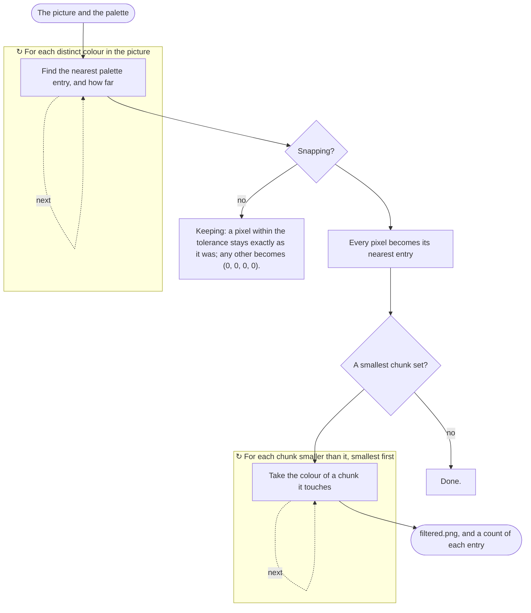
```mermaid
flowchart TD
  s1(["The picture and the palette"])
  subgraph s2["↻ For each distinct colour in the picture"]
    s3["Find the nearest palette entry, and how far"]
  end
  s3 -. next .-> s3
  s1 --> s3
  s4{"Snapping?"}
  s5["Keeping: a pixel within the tolerance stays exactly as it was; any other becomes (0, 0, 0, 0)."]
  s4 -- no --> s5
  s3 --> s4
  s6["Every pixel becomes its nearest entry"]
  s4 --> s6
  s7{"A smallest chunk set?"}
  s8["Done."]
  s7 -- no --> s8
  s6 --> s7
  subgraph s9["↻ For each chunk smaller than it, smallest first"]
    s10["Take the colour of a chunk it touches"]
  end
  s10 -. next .-> s10
  s7 --> s10
  s11(["filtered.png, and a count of each entry"])
  s10 --> s11
```

- *In:* The picture and the palette
- **↻ For each distinct colour in the picture**
  - Find the nearest palette entry, and how far — Distance in the HSB cone, with opacity as one more side (100 = black to white, or clear to solid).
- **Snapping?** *If not:* Keeping: a pixel within the tolerance stays exactly as it was; any other becomes (0, 0, 0, 0).
- Every pixel becomes its nearest entry — Exactly: the palette’s colour and opacity.
- **A smallest chunk set?** *If not:* Done.
- **↻ For each chunk smaller than it, smallest first** — A chunk: touching pixels (corners included) of one entry.
  - Take the colour of a chunk it touches — Of those, the entry nearest its own pixels’ original colours. It then joins that chunk.
- *Out:* filtered.png, and a count of each entry

### Pseudocode

```
def hsba(c):        # a point in the HSB cone, plus opacity
  chroma = max(r,g,b) - min(r,g,b); v = max(r,g,b)
  return (chroma*cos(hue), chroma*sin(hue), v, alpha)

def distance(p, q):
  if p.alpha == 0 or q.alpha == 0: return 100 * |p.alpha - q.alpha|
  return 100 * hypot(p.x-q.x, p.y-q.y, p.v-q.v, p.alpha-q.alpha)

for each distinct colour c: nearest[c], d[c] = min over entries of distance

if mode == keep:
  out[p] = pixel[p] if d[colour(p)] <= tolerance else (0,0,0,0)
else:  # snap
  entry[p] = nearest[colour(p)]
  if min_chunk > 1:
    for chunk in chunks(entry) sorted by size, while size < min_chunk:
      touching = entries of chunks bordering it
      chunk takes argmin over touching of Σ distance(original pixel, entry)
  out[p] = palette[entry[p]]           # colour and opacity, exactly
```

### Why hue, saturation and brightness

The distance is taken in the HSB cone: hue is an angle, saturation times brightness the distance out from the middle, brightness the height. Because the cone narrows to a point at black, hue matters only as much as a colour has any — two greys are not pushed apart by the hue numbers rounding gives them, and a dark red is nearer black than a bright red is. Opacity is measured beside it; a fully clear pixel has no colour, so against it only opacity counts.

### Keep is exact

Keeping never recolours or fades anything: a pixel that matches comes out with exactly its own colour and opacity, and one that does not comes out clear. At **Tolerance** 0 only exact matches are kept, which is what flat artwork drawn from the palette needs; a photograph needs room.

### Snap is exact too

Snapping always takes the nearest entry, whatever the distance, and writes it exactly — so a palette of five colours and a clear one gives a picture with six values in it and no others. An anti-aliased edge pixel becomes the colour or clear depending which it is nearer, never a neighbouring colour.

### Smallest chunk

Snapping a photograph leaves specks: single pixels that happened to be nearer another entry. Chunks under **Smallest chunk** pixels take the colour of a chunk they touch — the touching entry nearest to what their pixels originally were, not simply the one surrounding them most. Smallest first, so a speck inside a speck is settled before the one round it; a chunk that takes a neighbour’s colour joins it, and they grow together.

### Settings

| Setting | What it changes |
| --- | --- |
| Mode | Keep only palette colours, or snap every pixel to the palette. |
| Tolerance | Keep only: how far a pixel may be from a palette colour and still count as it. |
| Smallest chunk | Snap only: chunks smaller than this take a neighbouring chunk’s colour. |

**Cost:** Distinct colours × palette entries for the matching, one pass over the pixels to write, and a flood over the pixels for the chunks.

### Further reading

- [HSL and HSV](https://en.wikipedia.org/wiki/HSL_and_HSV) — The hue–saturation–brightness model, and the cone it is drawn as.
- [Connected-component labelling](https://en.wikipedia.org/wiki/Connected-component_labeling) — How the chunks are found.

*Code:* `packages/shared/src/flows/paletteFilter.ts — hsbaOf, hsbaDistance, mergeSmallChunks`

## Image Extraction

**Cutting out: fills, cuts and regions replayed into a mask** · `art.cutout`

The mask is never painted: it is rebuilt from the list of things you did, in the order you did them. Each fill floods out from its click to every neighbour within its tolerance of the clicked colour, stopping at cut lines; each region takes or gives back everything inside its outline. Then erase cuts are applied, small islands dropped, the mask grown or shrunk, and its edge feathered.

### The steps

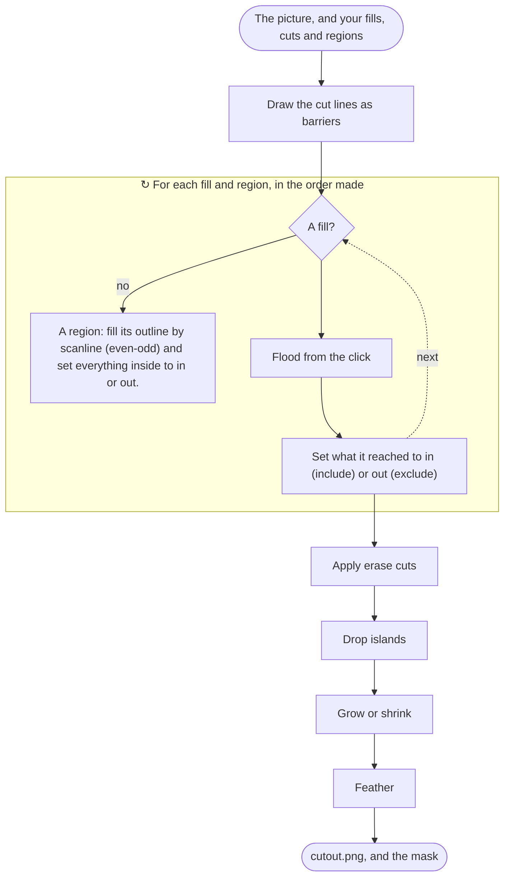
```mermaid
flowchart TD
  s1(["The picture, and your fills, cuts and regions"])
  s2["Draw the cut lines as barriers"]
  s1 --> s2
  subgraph s3["↻ For each fill and region, in the order made"]
    s4{"A fill?"}
    s5["A region: fill its outline by scanline (even-odd) and set everything inside to in or out."]
    s4 -- no --> s5
    s6["Flood from the click"]
    s4 --> s6
    s7["Set what it reached to in (include) or out (exclude)"]
    s6 --> s7
  end
  s7 -. next .-> s4
  s2 --> s4
  s8["Apply erase cuts"]
  s7 --> s8
  s9["Drop islands"]
  s8 --> s9
  s10["Grow or shrink"]
  s9 --> s10
  s11["Feather"]
  s10 --> s11
  s12(["cutout.png, and the mask"])
  s11 --> s12
```

- *In:* The picture, and your fills, cuts and regions
- Draw the cut lines as barriers — Each a smooth curve through its points, the cut width wide.
- **↻ For each fill and region, in the order made**
  - **A fill?** *If not:* A region: fill its outline by scanline (even-odd) and set everything inside to in or out.
  - Flood from the click — Take each neighbour (4 or 8 ways) within the tolerance of the clicked pixel’s colour, in OKLab; never cross a barrier.
  - Set what it reached to in (include) or out (exclude) — A later one covers an earlier one.
- Apply erase cuts — Everything under them goes out.
- Drop islands — Pieces smaller than Drop islands under.
- Grow or shrink — A pixel joins if any neighbour is in (grow), or leaves if any is out (shrink), once per pixel of Grow.
- Feather — A box blur of the edge, three times over — close to a Gaussian.
- *Out:* cutout.png, and the mask

### Pseudocode

```
blocked = rasterise(cut lines, width = cut width)      # barriers
inside = zeros
for object in fills_and_regions sorted by when made:
  if object is region:
    area = scanline_fill(outline(object))                # even-odd
  else:                                                  # a fill
    target = colour at object.click
    area = flood(from click, while oklab(pixel, target) <= tolerance
                 and not blocked, neighbours = 4 or 8)
  inside[area] = 1 if object.include else 0             # last one wins
inside[under erase cuts] = 0
drop connected pieces smaller than min_island
repeat |grow| times: dilate (grow > 0) or erode (grow < 0)
alpha = box_blur³(inside, feather) if feather else inside
cutout = picture with alpha
```

### Derived, never painted

What is stored is a list: fills dropped, lines cut, regions drawn. The mask is recomputed from it on every change. So each of them is a real object you can select, change or delete — deleting a fill takes its area with it — rather than a stroke of paint that is permanent the moment it lands.

### Tolerance against the clicked colour

A flood takes a neighbour when it is within the tolerance of the **clicked** pixel’s colour, not of the pixel beside it. Comparing neighbour to neighbour lets a gradient walk across the whole picture one tiny step at a time — the classic magic wand that selects everything. Colour distance is in OKLab (×100), so the tolerance means the same for dark and light colours. Each fill has its own tolerance, since the edge of a face and the edge of a sky need different ones.

### Order

Fills and regions are applied in the order they were made: an exclude after an include takes a bite out of it, and an include after that puts some back. That is what clicking feels like, so it is what the list means.

### Cuts

A cut is a smooth curve (Catmull-Rom through its points; two points make a straight cut) drawn as a barrier a fill cannot cross — at least a pixel wide, because a one-pixel line leaks through diagonal gaps. An erase cut also clears what it covers, after everything else.

### Cleaning up

**Drop islands** removes pieces of the mask smaller than a size; **Grow** dilates (or with a negative value erodes) the mask a pixel at a time; **Feather** blurs its edge with a box blur run three times, which is very close to a Gaussian blur and much cheaper.

### Settings

| Setting | What it changes |
| --- | --- |
| Tolerance | The default tolerance for a new fill (each fill keeps its own). |
| Diagonal | Whether a fill spreads to the 8 neighbours or only the 4. |
| Cut width | How wide a new cut is. |
| Drop islands under | Pieces of the mask smaller than this are dropped. |
| Grow | Pixels added round the mask (negative: taken off). |
| Feather | How soft the mask’s edge is, in pixels. |

**Cost:** Each fill visits the pixels it takes once; the clean-up steps are a pass or a few over the picture.

### Further reading

- [Flood fill](https://en.wikipedia.org/wiki/Flood_fill) — The fill, done with an explicit stack so a large region cannot overflow.
- [Scanline polygon fill (even–odd rule)](https://en.wikipedia.org/wiki/Even%E2%80%93odd_rule) — How a region’s outline is filled.
- [Mathematical morphology](https://en.wikipedia.org/wiki/Mathematical_morphology) — Dilation and erosion: what Grow does.
- [Box blur](https://en.wikipedia.org/wiki/Box_blur) — Three box blurs approximate a Gaussian: what Feather does.
- [Centripetal Catmull–Rom spline](https://en.wikipedia.org/wiki/Centripetal_Catmull%E2%80%93Rom_spline) — The smooth curve cut lines and regions are drawn through.

*Code:* `packages/shared/src/flows/cutout.ts — buildMask, floodFrom, blockedBy, fillOutline, grow, feather`

## Video Background

**A background from a video: each pixel’s most common colour** · `art.video.background`

The clip is sampled into frames. For every pixel, its colours across the frames are grouped — a colour joins the first group whose average it is within the tolerance of — and the biggest group is the pixel’s most common colour. If that group holds at least the agreement share of the frames, the pixel takes the group’s average colour; otherwise no colour is common enough and it is clear. Regions and strokes marked on single frames are then laid on in order.

### The steps

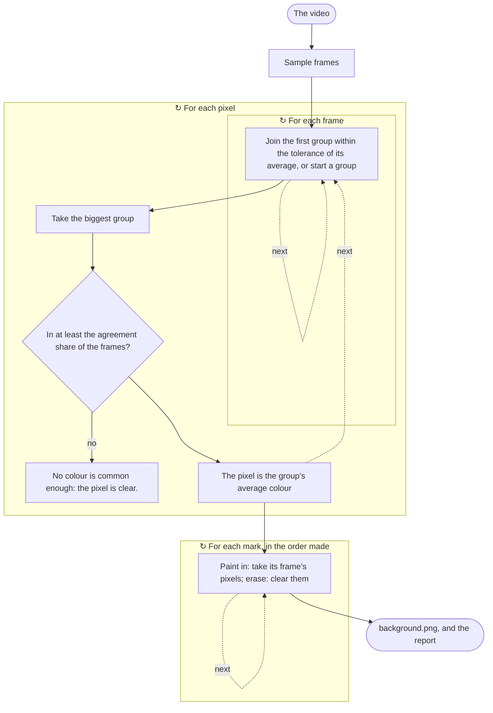
```mermaid
flowchart TD
  s1(["The video"])
  s2["Sample frames"]
  s1 --> s2
  subgraph s3["↻ For each pixel"]
    subgraph s4["↻ For each frame"]
      s5["Join the first group within the tolerance of its average, or start a group"]
    end
    s5 -. next .-> s5
    s6["Take the biggest group"]
    s5 --> s6
    s7{"In at least the agreement share of the frames?"}
    s8["No colour is common enough: the pixel is clear."]
    s7 -- no --> s8
    s6 --> s7
    s9["The pixel is the group’s average colour"]
    s7 --> s9
  end
  s9 -. next .-> s5
  s2 --> s5
  subgraph s10["↻ For each mark, in the order made"]
    s11["Paint in: take its frame’s pixels; erase: clear them"]
  end
  s11 -. next .-> s11
  s9 --> s11
  s12(["background.png, and the report"])
  s11 --> s12
```

- *In:* The video
- Sample frames — So many a second, or so many in all; read no bigger than all of them together fit in 40 million pixels.
- **↻ For each pixel**
  - **↻ For each frame**
    - Join the first group within the tolerance of its average, or start a group
  - Take the biggest group — Counted again against its final average.
  - **In at least the agreement share of the frames?** *If not:* No colour is common enough: the pixel is clear.
  - The pixel is the group’s average colour
- **↻ For each mark, in the order made**
  - Paint in: take its frame’s pixels; erase: clear them
- *Out:* background.png, and the report

### Pseudocode

```
frames = sample(video, fps or total), each at the budgeted size
for each pixel p:
  groups = []                                # (sum of colours, count)
  for f in frames:
    c = f[p]
    g = first group with |mean(g) - c| <= tolerance      # RGBA distance
    if g: g.add(c) else: groups += Group(c)
  best = biggest group
  members = [f[p] for f in frames if |f[p] - mean(best)| <= tolerance]
  if len(members) / len(frames) >= agreement:
    background[p] = mean(members)
  else:
    background[p] = clear
for mark in marks (in order):
  for p in mark's region or stroke:
    background[p] = frame_nearest(mark.time)[p] if include else clear
```

### The most common colour, not the average

Averaging a pixel over the frames mixes the background with whatever walked past. The median does better, but still drifts when something lingers. Taking the **most common** colour — the biggest group of colours that are the same within the tolerance — gives the background wherever it is visible more often than anything else is, and ignores the rest entirely: the colour is the average of that group only.

### Agreement

A pixel is kept only if its most common colour is in at least **Agreement** of the frames. At 50% it is the colour more often than not; at 100% only pixels that never change are kept; lower it for a character who stands still for most of the clip. Below the agreement no colour is common enough to trust, and the pixel is left clear rather than guessed.

### Grouping

Colours are grouped as they come, frame by frame: each joins the first group whose running average it is within the **Tolerance** of (over red, green, blue and opacity, with black to white at 100), or starts a new group. The biggest group is then counted again against its final average, so the order of the frames matters little.

### Putting back by hand

A character that never moves off part of the background leaves it clear, or wrong. Pick a frame where that part can be seen and paint it in, or draw round it: those pixels are taken from that frame. The eraser takes pixels out. Marks are laid on in the order made, so a later erase clears an earlier paint.

### Settings

| Setting | What it changes |
| --- | --- |
| Frames in all / a second | How many frames are compared. More frames make the most common colour surer, and each is read smaller. |
| Tolerance | How far apart two colours may be and still count as the same. |
| Agreement | The share of frames the most common colour must be in for the pixel to be kept. |
| Brush | The radius of the brush that paints or erases. |

**Cost:** Pixels × frames × groups — groups are few (usually one to three), so about pixels × frames.

### Further reading

- [Background subtraction](https://en.wikipedia.org/wiki/Background_subtraction) — The wider problem of separating a still background from what moves over it.
- [Mode (statistics)](https://en.wikipedia.org/wiki/Mode_(statistics)) — The most common value, which is what each pixel takes.

*Code:* `packages/shared/src/flows/videoBackground.ts — commonestBackground, applyMarks, backgroundFrameSize`

## Shot Split

**Finding cuts: compare samples, then binary-search each cut to the frame** · `animation.video.shots`

Every frame is boiled down to an embedding — an 8 × 8 colour thumbnail and a 64-bin colour histogram. The video is sampled coarsely; wherever two neighbouring samples differ by more than the threshold, there is a cut between them, and a binary search finds its exact frame by asking, of the middle frame, which side it looks like. Shots shorter than the minimum are then joined to the neighbour they are least unlike.

### The steps

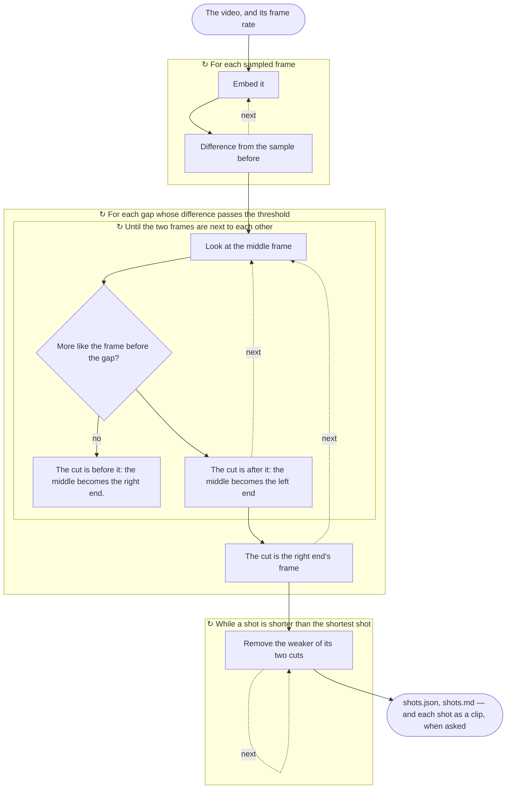
```mermaid
flowchart TD
  s1(["The video, and its frame rate"])
  subgraph s2["↻ For each sampled frame"]
    s3["Embed it"]
    s4["Difference from the sample before"]
    s3 --> s4
  end
  s4 -. next .-> s3
  s1 --> s3
  subgraph s5["↻ For each gap whose difference passes the threshold"]
    subgraph s6["↻ Until the two frames are next to each other"]
      s7["Look at the middle frame"]
      s8{"More like the frame before the gap?"}
      s9["The cut is before it: the middle becomes the right end."]
      s8 -- no --> s9
      s7 --> s8
      s10["The cut is after it: the middle becomes the left end"]
      s8 --> s10
    end
    s10 -. next .-> s7
    s11["The cut is the right end’s frame"]
    s10 --> s11
  end
  s11 -. next .-> s7
  s4 --> s7
  subgraph s12["↻ While a shot is shorter than the shortest shot"]
    s13["Remove the weaker of its two cuts"]
  end
  s13 -. next .-> s13
  s11 --> s13
  s14(["shots.json, shots.md — and each shot as a clip, when asked"])
  s13 --> s14
```

- *In:* The video, and its frame rate
- **↻ For each sampled frame** — So many a second, or so many in all.
  - Embed it — 8 × 8 thumbnail + 4 × 4 × 4 colour histogram.
  - Difference from the sample before — ½ mean thumbnail difference + ½ histogram distance, 0–1.
- **↻ For each gap whose difference passes the threshold**
  - **↻ Until the two frames are next to each other**
    - Look at the middle frame
    - **More like the frame before the gap?** *If not:* The cut is before it: the middle becomes the right end.
    - The cut is after it: the middle becomes the left end
  - The cut is the right end’s frame
- **↻ While a shot is shorter than the shortest shot**
  - Remove the weaker of its two cuts — It joins the neighbour it is least unlike.
- *Out:* shots.json, shots.md — and each shot as a clip, when asked

### Pseudocode

```
def embed(frame):
  thumb = mean colour of each cell of an 8x8 grid          # where colours are
  hist  = share of pixels in each of 4x4x4 colour bins    # which colours
  return thumb, hist

def difference(a, b):                                       # 0 .. 1
  return 0.5 * mean(|a.thumb - b.thumb|) + 0.5 * sum(|a.hist - b.hist|) / 2

samples = frames at the sampling times
cuts = []
for (prev, next) in neighbouring samples:
  if difference(prev, next) < threshold: continue
  lo, hi = frame(prev), frame(next)            # lo looks like before, hi like after
  while hi - lo > 1:
    mid = (lo + hi) // 2
    if difference(mid, prev) <= difference(mid, next): lo = mid
    else: hi = mid
  cuts += hi

while some shot is shorter than min_shot:
  take the shortest; drop its weaker cut (the lower difference)
```

### Two views of a frame

The thumbnail says **where** the colours are; the histogram says **which** colours there are. A camera pan moves the thumbnail a lot and the histogram little; a cut to a different scene changes both. Taking half of each makes a pan look like one shot and a cut look like a cut.

### Why binary search

Comparing every frame with the next is exact and slow. Sampling is fast and only knows a cut is somewhere in a gap. Binary search gets both: each look halves the gap, so a cut anywhere in two seconds at 24 frames a second (48 frames) is found in about six looks. The middle frame is asked which end it looks more like; the cut is the first frame that looks like the far end.

### Short shots

A flash frame, or the middle of a dissolve, can pass the threshold on both sides and make a shot a few frames long. Any shot shorter than **Shortest shot** loses the weaker of its two cuts — the one with the smaller difference — so it joins the neighbour it is least unlike. Shortest first, until none is too short.

### What it misses

- Two cuts between the same two samples are found as one. Sample more often for fast cutting.
- A slow dissolve changes a little at each sample and may never pass the threshold.
- A sudden flash or a very fast pan can pass it and make a false cut — which the shots editor lets you join back.

### Settings

| Setting | What it changes |
| --- | --- |
| Compare every / Frames compared | How often frames are sampled. Cuts closer together than one sample apart are found as one. |
| A cut is a difference of | How unlike two samples must be for a cut between them. |
| Shortest shot | Shots shorter than this are joined to a neighbour. |
| Frame rate | What “a frame” is: the search narrows each cut to one. |

**Cost:** One look per sample, plus about log₂(frames per gap) looks per cut. Each look decodes a frame, which is most of the time.

**Try it:** Click a shot to see it large and step through it frame by frame with ← and →: the first frame of each shot is where the search landed.

### Further reading

- [Shot transition detection](https://en.wikipedia.org/wiki/Shot_transition_detection) — The problem, and the kinds of transition that make it hard.
- [Binary search](https://en.wikipedia.org/wiki/Binary_search_algorithm) — Halving the gap until the cut is between two neighbouring frames.
- [Color histogram](https://en.wikipedia.org/wiki/Color_histogram) — The “which colours” half of a frame’s embedding.

*Code:* `packages/shared/src/flows/shots.ts — embedFrame, frameDifference, detectShots, dropShortShots`

## Video Edit

**Editing a video: segments, a crop, and recording by playing it through** · `animation.video.edit`

The video is a row of segments end to end. A split cuts the segment under the playhead at the nearest frame; a segment is kept or deleted; two neighbours can be joined. On Generate the kept segments are played through a canvas the size of the crop, one after another, and the canvas is recorded — as one video, or a clip per segment.

### The steps

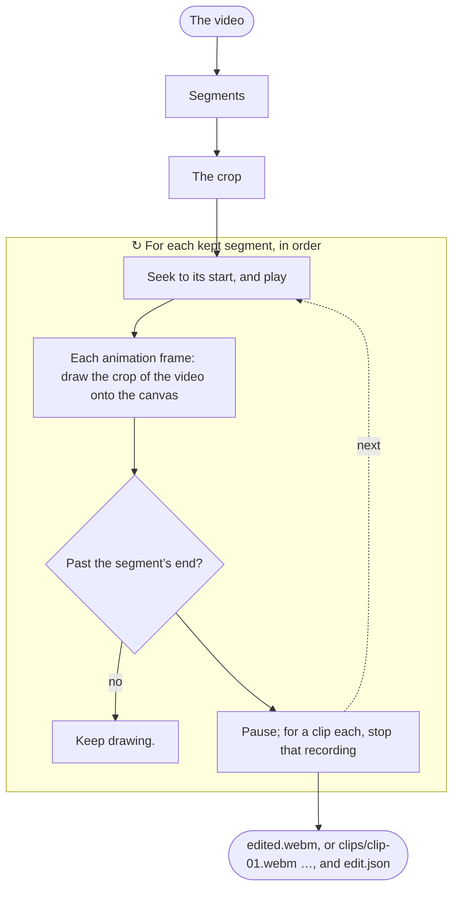
```mermaid
flowchart TD
  s1(["The video"])
  s2["Segments"]
  s1 --> s2
  s3["The crop"]
  s2 --> s3
  subgraph s4["↻ For each kept segment, in order"]
    s5["Seek to its start, and play"]
    s6["Each animation frame: draw the crop of the video onto the canvas"]
    s5 --> s6
    s7{"Past the segment’s end?"}
    s8["Keep drawing."]
    s7 -- no --> s8
    s6 --> s7
    s9["Pause; for a clip each, stop that recording"]
    s7 --> s9
  end
  s9 -. next .-> s5
  s3 --> s5
  s10(["edited.webm, or clips/clip-01.webm …, and edit.json"])
  s9 --> s10
```

- *In:* The video
- Segments — At first one, the whole video. Splits snap to the nearest frame start.
- The crop — One box for every frame, its sides made even (video encoders need even sizes).
- **↻ For each kept segment, in order**
  - Seek to its start, and play
  - Each animation frame: draw the crop of the video onto the canvas
  - **Past the segment’s end?** *If not:* Keep drawing.
  - Pause; for a clip each, stop that recording
- *Out:* edited.webm, or clips/clip-01.webm …, and edit.json

### Pseudocode

```
segments = [(0, duration, kept)]
split(t):  s = segment containing t; t = nearest frame start
           replace s with (s.start, t) and (t, s.end), same kept/deleted
crop = even(clamp(box, inside video))

canvas = new canvas(crop.width, crop.height)
recorder = MediaRecorder(canvas.captureStream(fps), 'video/webm; vp9')
for s in segments if s.kept:
  video.currentTime = s.start; video.play()
  every animation frame until video.currentTime >= s.end:
    canvas.draw(video, source = crop, target = whole canvas)
  video.pause()
  if output == clips: recorder.stop(); save; start a new recorder
save edit.json = { crop, kept segments, deleted segments, lengths }
```

### Recording by playing

A browser has no video encoder to call directly on frames, but it can record a canvas as it is drawn. So the edit is played — each kept segment in turn, drawn through the crop onto a canvas — and the canvas is recorded as WebM (VP9 where the browser has it). That is why recording takes as long as the edit lasts, and why the sound is not kept.

### Frames, exactly

A “frame” is one frame at the frame rate you set, since a browser cannot read a video’s own rate. Splits and steps land on a frame’s exact start (not rounded to the millisecond, which can show the frame before), and stepping reads the current frame with a small tolerance, so each press moves exactly one frame.

### Playing the edit

With **play the edit** on, the player skips deleted segments as it plays: whenever the time enters a deleted segment it jumps to the start of the next kept one, and stops after the last — so what you see is what will be written.

### Settings

| Setting | What it changes |
| --- | --- |
| Frame rate | What splits and steps snap to, and the rate the result is recorded at. |
| Crop | The box every frame is cut to, with even sides. |
| What comes out | One video of the kept segments joined, or a clip for each. |

**Cost:** Real time: recording takes as long as the kept segments last.

### Further reading

- [MediaRecorder](https://developer.mozilla.org/en-US/docs/Web/API/MediaRecorder) — Recording a stream in the browser.
- [HTMLCanvasElement.captureStream](https://developer.mozilla.org/en-US/docs/Web/API/HTMLCanvasElement/captureStream) — Turning a canvas into a video stream to record.
- [Edit decision list](https://en.wikipedia.org/wiki/Edit_decision_list) — What edit.json is: the edit, to redo from the source.

*Code:* `packages/shared/src/flows/videoEdit.ts — editSegments, splitSegmentAt, stepFrame, videoCropRect`, `packages/client/src/components/editors/renderVideo.ts — renderEdit`

## Video Source

**Bringing a video in: checked by its bytes, fetched safely** · `animation.video.source`

A video is uploaded as its raw bytes, or fetched from a public address. Either way it is known by its first bytes — the signature every video format starts with — not by its name or what a server claims. A fetch refuses addresses on this machine or the private network before asking, and stops at the size limit.

### The steps

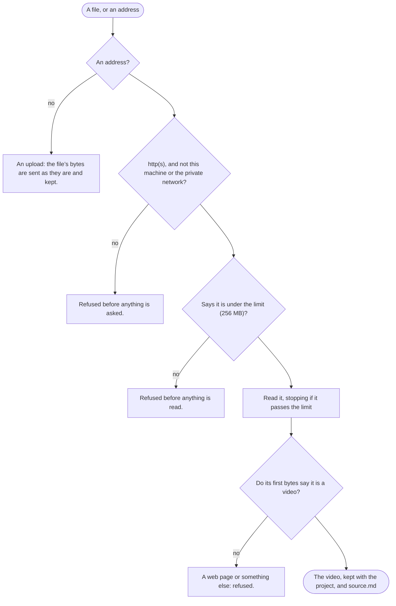
```mermaid
flowchart TD
  s1(["A file, or an address"])
  s2{"An address?"}
  s3["An upload: the file’s bytes are sent as they are and kept."]
  s2 -- no --> s3
  s1 --> s2
  s4{"http(s), and not this machine or the private network?"}
  s5["Refused before anything is asked."]
  s4 -- no --> s5
  s2 --> s4
  s6{"Says it is under the limit (256 MB)?"}
  s7["Refused before anything is read."]
  s6 -- no --> s7
  s4 --> s6
  s8["Read it, stopping if it passes the limit"]
  s6 --> s8
  s9{"Do its first bytes say it is a video?"}
  s10["A web page or something else: refused."]
  s9 -- no --> s10
  s8 --> s9
  s11(["The video, kept with the project, and source.md"])
  s9 --> s11
```

- *In:* A file, or an address
- **An address?** *If not:* An upload: the file’s bytes are sent as they are and kept.
- **http(s), and not this machine or the private network?** *If not:* Refused before anything is asked.
- **Says it is under the limit (256 MB)?** *If not:* Refused before anything is read.
- Read it, stopping if it passes the limit
- **Do its first bytes say it is a video?** — MP4/QuickTime (ftyp), WebM/Matroska (EBML), Ogg. *If not:* A web page or something else: refused.
- *Out:* The video, kept with the project, and source.md

### Pseudocode

```
def sniff(bytes):
  if bytes[4:8] == "ftyp": return quicktime if brand == "qt  " else mp4
  if bytes[0:4] == 1A 45 DF A3:                      # EBML
    return webm if "webm" in bytes[:64] else matroska
  if bytes[0:4] == "OggS": return ogg
  if bytes[4:8] in ("moov", "mdat", "wide"): return quicktime
  return None

fetch(url):
  refuse unless scheme is http(s) and host is public
  refuse if content-length > limit
  read, stopping past limit
  type = sniff(bytes) or refuse("a web page, not a video")
```

### Known by its bytes

A file name can say anything, and a server’s content type is often wrong (or says a page is a video). Every video container starts with a fixed signature, so the first few bytes say what it is. A page that *plays* a video is HTML, not the video, and is refused rather than kept.

### Safe fetching

The server does the download, so it must not be tricked into reaching places a browser could not: addresses on this machine and on the private network are refused before any request. A response that says it is too big is refused before reading; one that does not say is stopped as soon as it passes the limit.

### Measuring

The length and size are read by playing the file in the browser. A video recorded in a browser often does not say how long it is until read to the end, so the editor seeks far past the end once to make it find out.

### Further reading

- [List of file signatures](https://en.wikipedia.org/wiki/List_of_file_signatures) — The “magic numbers” formats start with.
- [Server-side request forgery](https://owasp.org/www-community/attacks/Server_Side_Request_Forgery) — Why a server that fetches addresses refuses private ones.

*Code:* `packages/shared/src/flows/videoSource.ts — sniffVideoType`, `packages/server/src/net/fetchVideo.ts — fetchVideo`

## Rig Match

**Finding a rigged body in a picture, by small features** · `animation.match`

The bound drawing is painted at rest and cut into small square features, part by part. The picture is cut into features too, at a range of sizes and angles. Each feature is turned into a short list of numbers, and matches between body and picture features vote for where the whole body is. Then each part, from the root down, is turned and sized to where its own features match best, and every part gets a confidence.

### The steps

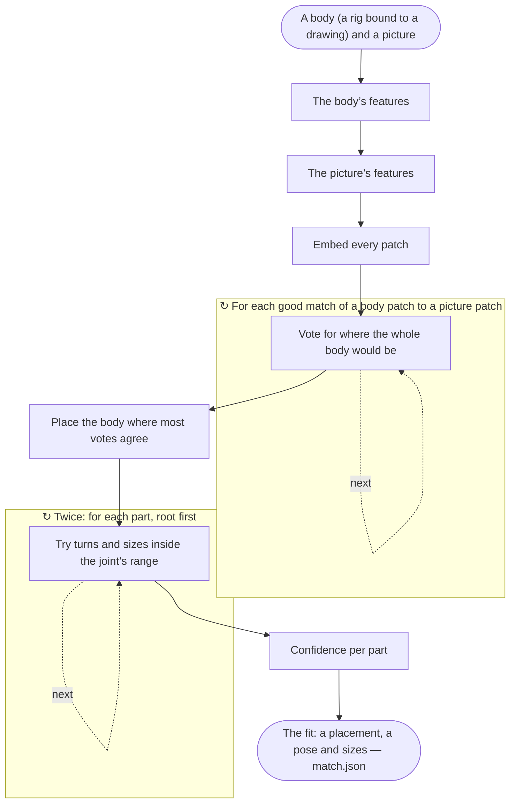
```mermaid
flowchart TD
  s1(["A body (a rig bound to a drawing) and a picture"])
  s2["The body’s features"]
  s1 --> s2
  s3["The picture’s features"]
  s2 --> s3
  s4["Embed every patch"]
  s3 --> s4
  subgraph s5["↻ For each good match of a body patch to a picture patch"]
    s6["Vote for where the whole body would be"]
  end
  s6 -. next .-> s6
  s4 --> s6
  s7["Place the body where most votes agree"]
  s6 --> s7
  subgraph s8["↻ Twice: for each part, root first"]
    s9["Try turns and sizes inside the joint’s range"]
  end
  s9 -. next .-> s9
  s7 --> s9
  s10["Confidence per part"]
  s9 --> s10
  s11(["The fit: a placement, a pose and sizes — match.json"])
  s10 --> s11
```

- *In:* A body (a rig bound to a drawing) and a picture
- The body’s features — Paint the drawing at rest; from each part take square patches where there is most to see — more for a big part.
- The picture’s features — Patches all over it, each at a range of sizes and turned through a range of angles.
- Embed every patch — For each cell of a 4 × 4 grid: OKLab colour, how covered, how much edge.
- **↻ For each good match of a body patch to a picture patch**
  - Vote for where the whole body would be — This patch of chest found here, this big, turned this far.
- Place the body where most votes agree
- **↻ Twice: for each part, root first**
  - Try turns and sizes inside the joint’s range — Keep the one where its features, and the parts below it, match best.
- Confidence per part — How well its features match where they ended up, against how well they match the picture at large.
- *Out:* The fit: a placement, a pose and sizes — match.json

### Pseudocode

```
body = paint(bound drawing at rest)
body_feats  = for part in parts: best patches of part (count ~ part size)
image_feats = patches over the picture at scales s in [1/range .. range]
              and angles a in [-angle .. +angle]
embed(patch) = for cell in 4x4: (oklab colour, coverage, edge strength)

votes = {}
for bf in body_feats:
  for pf in nearest image_feats to bf by embedding:
    placement = where the body is if bf sits at pf (x, y, scale, rotation)
    votes[placement] += similarity(bf, pf)
fit.placement = the placement with the most votes

repeat 2 times:
  for part in bones, root first:
    for angle, size within joint limits:
      score = match of part's features (and its children's) at that pose
    keep the best; tighten the placement
confidence[part] = match where it ended up vs match anywhere in the picture
```

### Features, not the whole body at once

Matching the whole body as one picture fails as soon as an arm moves. Small patches of each part can be found wherever that part is, and each one on its own says where the body would be. Many matches agreeing on one placement is strong evidence; a few stray matches are outvoted.

### What a patch is

A patch is reduced to numbers: for each cell of a 4 × 4 grid, its colour in OKLab, how much of the cell is covered, and how much edge it has. Two patches are as alike as those numbers are. A body patch is only judged where the body *is*: its empty corners say nothing about the picture’s background.

### Root first

Once the body is placed, each bone is fitted in turn from the root down, turned (within its joint’s range) and sized to where its own features match best, taking the parts below it along. Doing it twice, and tightening the placement between, lets later parts correct an early guess.

### Confidence

A patch of plain skin matches everywhere, so matching here is no evidence. Each feature’s match where it ended up is weighed against how well it matches the picture at large: a feature that matches only here is strong evidence, one that matches everywhere is none.

### Settings

| Setting | What it changes |
| --- | --- |
| Features | How many patches each part gives, before sizing by how big it is. More is steadier and slower. |
| Scale range | How much bigger or smaller the body may be in the picture than it was drawn. |
| Angle range | How far the body, and each part against its parent, may turn. |
| Keep limits | Keep every joint inside the rig’s own range of motion. |

**Cost:** Grows with picture features × scales × angles; it runs in a worker so the editor stays responsive. Deterministic: the same inputs give the same fit.

### Further reading

- [Feature matching](https://en.wikipedia.org/wiki/Feature_(computer_vision)) — Finding an object by its small distinctive pieces.
- [Hough transform (voting)](https://en.wikipedia.org/wiki/Generalised_Hough_transform) — Many matches voting for one placement — the idea behind placing the body.
- [Pictorial structures](https://en.wikipedia.org/wiki/Pictorial_structure_model) — Finding a body as parts joined in a tree, fitted part by part.

*Code:* `packages/shared/src/flows/rigMatchSolve.ts — the solver`, `packages/shared/src/flows/rigMatch.ts — the fit and its settings`

## Video Rig Match

**A rig animation from a video: Rig Match on every sampled frame** · `animation.video.match`

The video is sampled, and Rig Match is run on each frame. A frame after one where the body was found starts its search from where the body was, since a character moves little between frames; after a frame where it was lost, the whole picture is searched again. Frames below the confidence threshold split the animation into segments, each a run of frames the body was found in.

### The steps

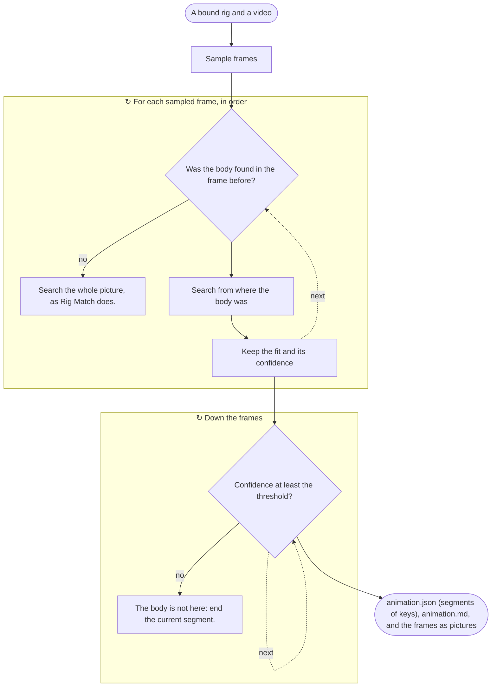
```mermaid
flowchart TD
  s1(["A bound rig and a video"])
  s2["Sample frames"]
  s1 --> s2
  subgraph s3["↻ For each sampled frame, in order"]
    s4{"Was the body found in the frame before?"}
    s5["Search the whole picture, as Rig Match does."]
    s4 -- no --> s5
    s6["Search from where the body was"]
    s4 --> s6
    s7["Keep the fit and its confidence"]
    s6 --> s7
  end
  s7 -. next .-> s4
  s2 --> s4
  subgraph s8["↻ Down the frames"]
    s9{"Confidence at least the threshold?"}
    s10["The body is not here: end the current segment."]
    s9 -- no --> s10
  end
  s9 -. next .-> s9
  s7 --> s9
  s11(["animation.json (segments of keys), animation.md, and the frames as pictures"])
  s9 --> s11
```

- *In:* A bound rig and a video
- Sample frames — So many a second or so many in all; never the very last frame.
- **↻ For each sampled frame, in order**
  - **Was the body found in the frame before?** *If not:* Search the whole picture, as Rig Match does.
  - Search from where the body was — Followed from the frame before.
  - Keep the fit and its confidence
- **↻ Down the frames**
  - **Confidence at least the threshold?** *If not:* The body is not here: end the current segment.
- *Out:* animation.json (segments of keys), animation.md, and the frames as pictures

### Pseudocode

```
times = frame_times(duration, sampling)          # never the last frame
previous = None
for t in times:
  picture = read frame at t
  if previous and previous.confidence >= threshold:
    fit = rig_match(picture, start_from = previous.fit)   # followed
  else:
    fit = rig_match(picture)                              # whole picture
  frames += (t, fit, fit.confidence)
  previous = frames[-1]

segments, run = [], []
for f in frames by time:
  if f.fit and f.confidence >= threshold: run += f
  else: close run as a segment
close run
```

### Following

Between one sampled frame and the next a character moves a little, so the search starts from the last fit instead of from nothing. That is faster and steadier. After a frame where the body was lost — off screen, hidden, a cut — the next frame searches the whole picture again.

### Segments

Below the **threshold**, a frame is taken not to show the character, and the animation is split there. Each segment is a run of frames the body was found in, written as keys: where the body is, each joint’s angle, each part’s size, and how sure the match was.

### Settings

| Setting | What it changes |
| --- | --- |
| Frames a second / in all | How densely the video is sampled. |
| Threshold | Below this confidence a frame does not show the character, and splits the animation. |
| Rig Match settings | Features, scale and angle ranges, and joint limits, as in Rig Match. |

**Cost:** One Rig Match per sampled frame — less for a followed frame.

### Further reading

- [Video tracking](https://en.wikipedia.org/wiki/Video_tracking) — Following an object from frame to frame, and re-finding it when lost.

*Code:* `packages/shared/src/flows/videoMatch.ts — frameTimes, segmentsOf, rigAnimationOf`, `packages/shared/src/flows/rigMatchSolve.ts`

## Animatic

**An animatic: the board’s panels timed into a cut** · `animation.animatic`

The storyboard decides what the shots are; the animatic decides how long each is held and which are in. Each panel’s length is its override if it has one, else the board’s, clamped to the minimum and maximum the wire’s rules set. Shots are laid end to end, with their start times and frame counts at the frame rate; Fit to target scales every shot by the same factor so the whole lands on the target length.

### The steps

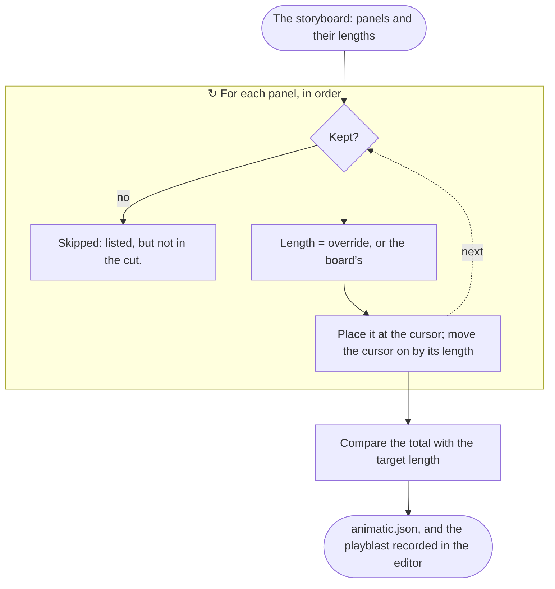
```mermaid
flowchart TD
  s1(["The storyboard: panels and their lengths"])
  subgraph s2["↻ For each panel, in order"]
    s3{"Kept?"}
    s4["Skipped: listed, but not in the cut."]
    s3 -- no --> s4
    s5["Length = override, or the board’s"]
    s3 --> s5
    s6["Place it at the cursor; move the cursor on by its length"]
    s5 --> s6
  end
  s6 -. next .-> s3
  s1 --> s3
  s7["Compare the total with the target length"]
  s6 --> s7
  s8(["animatic.json, and the playblast recorded in the editor"])
  s7 --> s8
```

- *In:* The storyboard: panels and their lengths
- **↻ For each panel, in order**
  - **Kept?** *If not:* Skipped: listed, but not in the cut.
  - Length = override, or the board’s — Then clamped between min duration and max duration from the wire’s rules.
  - Place it at the cursor; move the cursor on by its length — Start frame = start × fps; frames = length × fps (at least 1).
- Compare the total with the target length
- *Out:* animatic.json, and the playblast recorded in the editor

### Pseudocode

```
cursor = 0
for panel in board.panels:
  o = overrides[panel]
  if o.skip: skipped += panel; continue
  length = clamp(o.duration or panel.duration, min_duration, max_duration)
  clips += { panel, start: cursor, end: cursor + length,
             start_frame: round(cursor * fps), frames: max(1, round(length * fps)) }
  cursor += length
off_target = cursor - target

fit_to_target():
  scale = target / cursor
  for clip: override clip.duration = clip.duration * scale
```

### Timing, kept apart from drawing

Retiming here never touches the drawings: an override is stored per panel, and an override that says nothing is removed, so a reset leaves the shot following the board again.

### Fit to target

“It has to be 60 seconds”: every shot is scaled by target ÷ current length, keeping their proportions.

### Settings

| Setting | What it changes |
| --- | --- |
| Target length | What the cut is measured against, and what Fit to target scales it to. |
| min duration / max duration (rules) | Clamp every shot’s length. |

**Cost:** One pass over the panels.

### Further reading

- [Animatic](https://en.wikipedia.org/wiki/Animatic) — What an animatic is for.

*Code:* `packages/shared/src/flows/animatic.ts — resolveAnimaticCut, fitCutToTarget`

## Polygon Decomposition

**Turning a picture into shapes: edges, fills, outlines, then lines** · `art.vectorize`

Boundaries are found once for the whole picture with Canny edge detection in OKLab. The spaces between the edges are flooded into regions, and each region’s outline is traced, simplified (Ramer–Douglas–Peucker) and drawn as one polygon, with holes where something else is inside it. A polygon no wider than a stroke is drawn again as a line down its middle. Shapes of one colour that meet are joined, the minimums are applied, flat shapes become lines and shallow corners become curves. Optional rounds of refinement redraw the parts that came out worst.

### The steps

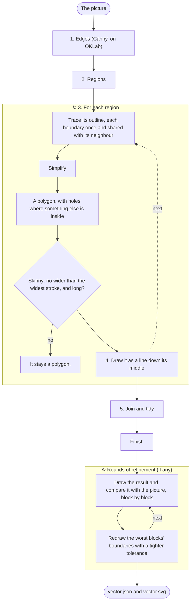
```mermaid
flowchart TD
  s1(["The picture"])
  s2["1. Edges (Canny, on OKLab)"]
  s1 --> s2
  s3["2. Regions"]
  s2 --> s3
  subgraph s4["↻ 3. For each region"]
    s5["Trace its outline, each boundary once and shared with its neighbour"]
    s6["Simplify"]
    s5 --> s6
    s7["A polygon, with holes where something else is inside"]
    s6 --> s7
    s8{"Skinny: no wider than the widest stroke, and long?"}
    s9["It stays a polygon."]
    s8 -- no --> s9
    s7 --> s8
    s10["4. Draw it as a line down its middle"]
    s8 --> s10
  end
  s10 -. next .-> s5
  s3 --> s5
  s11["5. Join and tidy"]
  s10 --> s11
  s12["Finish"]
  s11 --> s12
  subgraph s13["↻ Rounds of refinement (if any)"]
    s14["Draw the result and compare it with the picture, block by block"]
    s15["Redraw the worst blocks’ boundaries with a tighter tolerance"]
    s14 --> s15
  end
  s15 -. next .-> s14
  s12 --> s14
  s16(["vector.json and vector.svg"])
  s15 --> s16
```

- *In:* The picture
- 1. Edges (Canny, on OKLab) — Gradient by Sobel; thinned to one pixel; weak edge pixels kept only where they join strong ones.
- 2. Regions — Flood the space between the edges; hand the edge band to whichever side it looks like; drop regions under the smallest area.
- **↻ 3. For each region**
  - Trace its outline, each boundary once and shared with its neighbour
  - Simplify — Drop points the outline can lose moving no more than Simplify to within; loosen it for a shape over its point budget.
  - A polygon, with holes where something else is inside
  - **Skinny: no wider than the widest stroke, and long?** *If not:* It stays a polygon.
  - 4. Draw it as a line down its middle — Thin to a one-pixel skeleton, walk it, simplify; curved if it bends by more than the threshold.
- 5. Join and tidy — Same-colour polygons that share a side become one; lines whose ends meet become one; drop what is under the minimums.
- Finish — Flat polygons become lines; shallow corners become curves.
- **↻ Rounds of refinement (if any)**
  - Draw the result and compare it with the picture, block by block
  - Redraw the worst blocks’ boundaries with a tighter tolerance
- *Out:* vector.json and vector.svg

### Pseudocode

```
lab = to_oklab(picture)
edges = canny(lab, strong = contrast, weak = keep_going)
regions = flood the non-edge pixels; give each edge pixel to the side it looks like
regions = [r for r in regions if area(r) >= min_area]

shapes = []
for r in regions:
  outline = trace(r)                         # shared boundaries traced once
  outline = rdp(outline, detail)             # Ramer-Douglas-Peucker
  while points(outline) > max_points: outline = rdp(outline, looser)
  poly = Polygon(colour(r), outline, holes = inner outlines)
  if thickness(r) <= widest_stroke and long(r):
    skeleton = zhang_suen_thin(r)
    shapes += Line(walk(skeleton), width = stroke_width(r),
                   curved = bend > curve_threshold)
  else:
    shapes += poly

shapes = join(shapes)                        # same colour, touching
shapes = drop(shapes under min polygon area / min line length / node gap)
shapes = flat_to_lines(shapes, flat_tolerance)
shapes = smooth_shallow_nodes(shapes, smooth_angle)

repeat refine_rounds:
  error = compare(render(shapes), picture) per block
  retrace boundaries through the worst blocks more tightly
```

### Edges first

Finding the boundaries once, up front, is what makes the rest cheap: every later step reads the answer instead of comparing colours again. Canny does it in three steps, each for a reason:

- **On OKLab**, so a gradient means "how different this looks": in RGB a boundary between two blues reads steeper than one between two greens that are plainly further apart.
- **Thinned** to one pixel, because a gradient is a ridge several pixels wide and a boundary is a line; a fat boundary eats the regions either side and swallows thin strokes.
- **Joined** by hysteresis: a pixel over the weaker threshold is a boundary only where it touches one over the stronger. A boundary that fades for a pixel stays unbroken, and noise does not become boundaries.

### Regions by flooding between edges

Each region is the space between boundaries, flooded the way a fill tool floods — with no colour comparison while spreading. That asks where the picture **changes**, one answer for the whole image, instead of asking each pixel whether it is near the colour the fill started from (which leaks wherever shading is gradual). The pixels on the edge itself are then given to whichever side they look like, so a region includes the blended edge of what it stands for.

### Polygons, then lines

Every region is first a polygon, and the polygons partition the picture: neighbours share their boundary exactly, so there are no gaps or overlaps. A region no wider than **Widest a stroke may be** and long is a drawn mark rather than an area, so it is drawn again as a line down its middle: thinned to a one-pixel skeleton (Zhang–Suen), walked end to end, and simplified.

### Simplifying

A traced outline has a point at every pixel step — far more than any shape needs. Ramer–Douglas–Peucker keeps the point furthest from the straight line between two kept points whenever it is further than **Simplify to within**, and drops the rest. **At most, per shape** is a budget: a shape over it has its tolerance loosened until it fits.

### Refinement

Nothing in the fast path measures the result against the pixels. Each round of refinement draws the shapes, compares them with the picture in blocks, and retraces the boundaries through the worst blocks with a tighter tolerance — so the effort goes where the drawing is wrong.

### Settings

| Setting | What it changes |
| --- | --- |
| Widest a stroke may be | Regions no wider than this, and long, become lines. |
| Contrast that counts / …and to keep one going | Canny’s strong and weak thresholds. |
| Drop regions under | Regions smaller than this are merged away. |
| Simplify to within / At most, per shape | How far an outline may move to lose a point, and a point budget. |
| Curved if bent by | How bent a line must be to be drawn curved. |
| Nodes at least / Smallest polygon / Shortest line / Join line ends within | The clean-up minimums. |
| Flat shapes become lines / Smooth shallow corners | The finishing touches, by angle. |
| Rounds of refinement / Measured over blocks of / Worst blocks to work on | The slower pass that redraws the worst parts. |

**Cost:** A few passes over the pixels for edges and regions, then work in proportion to the outlines. Each round of refinement draws and compares the whole picture again.

### Further reading

- [Canny edge detector](https://en.wikipedia.org/wiki/Canny_edge_detector) — Gradient, non-maximum suppression and hysteresis.
- [Ramer–Douglas–Peucker](https://en.wikipedia.org/wiki/Ramer%E2%80%93Douglas%E2%80%93Peucker_algorithm) — How outlines lose points.
- [Zhang–Suen thinning](https://rosettacode.org/wiki/Zhang-Suen_thinning_algorithm) — How a stroke is thinned to its middle.
- [Image tracing](https://en.wikipedia.org/wiki/Image_tracing) — The wider problem of turning pixels into vector shapes.

*Code:* `packages/shared/src/flows/vectorize.ts — vectorize, findRegions, simplify, centreline, thin`, `packages/shared/src/flows/edges.ts — detectEdges`, `packages/shared/src/flows/join.ts`, `packages/shared/src/flows/tidy.ts`, `packages/shared/src/flows/vectorSmooth.ts`

## Vector Editor

**Editing shapes: anchors that are the truth, curves derived from them** · `art.vector.edit`

A shape is stored as its anchors and, for each, how curved the outline is through it and how much it turns. The Bézier curves an SVG needs are worked out from the anchors whenever the drawing is written, so dragging a point never means fixing up handles. Shapes that share a boundary share its nodes, so moving one moves both. The smooth brush averages the brushed nodes of a run a few at a time into one.

### The steps

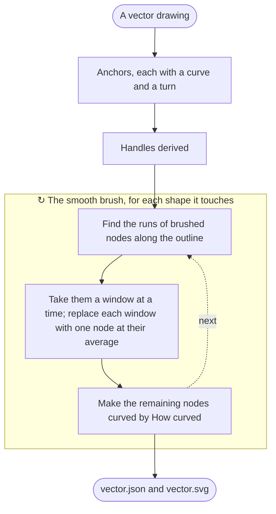
```mermaid
flowchart TD
  s1(["A vector drawing"])
  s2["Anchors, each with a curve and a turn"]
  s1 --> s2
  s3["Handles derived"]
  s2 --> s3
  subgraph s4["↻ The smooth brush, for each shape it touches"]
    s5["Find the runs of brushed nodes along the outline"]
    s6["Take them a window at a time; replace each window with one node at their average"]
    s5 --> s6
    s7["Make the remaining nodes curved by How curved"]
    s6 --> s7
  end
  s7 -. next .-> s5
  s3 --> s5
  s8(["vector.json and vector.svg"])
  s7 --> s8
```

- *In:* A vector drawing
- Anchors, each with a curve and a turn — Curve 0 is a corner; 1 is smooth, with handles a third of each segment long.
- Handles derived — The direction through a node is from the node before to the node after, turned by its turn.
- **↻ The smooth brush, for each shape it touches**
  - Find the runs of brushed nodes along the outline
  - Take them a window at a time; replace each window with one node at their average — In every shape sharing them, so neighbours still meet. An open line’s ends stay.
  - Make the remaining nodes curved by How curved
- *Out:* vector.json and vector.svg

### Pseudocode

```
def handles(node, prev, next):
  direction = rotate(next - prev, node.turn)          # the tangent
  ahead  = node + direction.unit * |next - node| / 3 * node.curve
  behind = node - direction.unit * |node - prev| / 3 * node.curve
  return ahead, behind                                # cubic Bézier handles

brush(shape, centre, radius, window, amount):
  for run in runs of nodes within radius of centre:
    for group in chunks(run, window):
      p = mean(group positions)
      move group[0] to p in every shape sharing it; delete the others
  set curve = amount on the nodes left
```

### Why anchors, not control points

An SVG stores cubic control points, and editing them is miserable: dragging one point means fixing up four numbers either side to keep the curve smooth, and adding a point mid-curve means solving for a split. Here the anchors are the truth; the Béziers are derived when the SVG is written. How curved a node is, and how it turns, are stored relative to its neighbours, so they survive the drawing being moved, turned or posed.

### Shared nodes

Neighbouring shapes share the points along the boundary between them. A node is a place, not a point of one shape: moving it moves every shape that has it, so a boundary can bend but never tear open.

### The smooth brush

A jagged traced outline has many nodes close together. Brushing over it averages them a window at a time — **Nodes averaged into one** — into single nodes at their average position, then curves the result by **How curved**. It never leaves an outline with too few nodes to be a shape.

### Settings

| Setting | What it changes |
| --- | --- |
| How curved / Turn | A selected node’s curve (0 corner, 1 smooth) and turn. |
| Brush size | The smooth brush’s radius. |
| Nodes averaged into one | How many brushed nodes become one. |
| How curved (brush) | How curved the brushed nodes are made. |

### Further reading

- [Bézier curve](https://en.wikipedia.org/wiki/B%C3%A9zier_curve) — The cubic curves the SVG is written with.
- [Cardinal spline](https://en.wikipedia.org/wiki/Cubic_Hermite_spline#Cardinal_spline) — Tangents from the neighbours either side, as the handles are derived here.

*Code:* `packages/shared/src/flows/vector.ts — toCubics, nodeTangent, changeNodes`, `packages/shared/src/flows/vectorSmooth.ts — averageNodeRuns, curveNodes`

## Line Graph

**Lines as a graph: fill, thin to the middle, trace between nodes** · `art.lines.graph`

The line picture is read back into each pixel’s confidence and width. The sure-enough pixels are filled into connected areas; each area is thinned to a one-pixel middle (Zhang–Suen); ends and junctions on the middle are the graph’s nodes, and the paths between them its lines. Each line keeps the mean width of the band it runs over. Short spurs are dropped, nodes joining just two lines are merged away, and each line is simplified.

### The steps

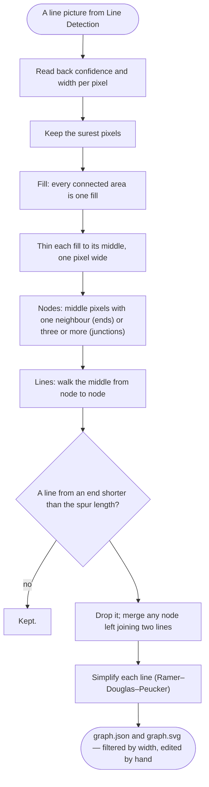
```mermaid
flowchart TD
  s1(["A line picture from Line Detection"])
  s2["Read back confidence and width per pixel"]
  s1 --> s2
  s3["Keep the surest pixels"]
  s2 --> s3
  s4["Fill: every connected area is one fill"]
  s3 --> s4
  s5["Thin each fill to its middle, one pixel wide"]
  s4 --> s5
  s6["Nodes: middle pixels with one neighbour (ends) or three or more (junctions)"]
  s5 --> s6
  s7["Lines: walk the middle from node to node"]
  s6 --> s7
  s8{"A line from an end shorter than the spur length?"}
  s9["Kept."]
  s8 -- no --> s9
  s7 --> s8
  s10["Drop it; merge any node left joining two lines"]
  s8 --> s10
  s11["Simplify each line (Ramer–Douglas–Peucker)"]
  s10 --> s11
  s12(["graph.json and graph.svg — filtered by width, edited by hand"])
  s11 --> s12
```

- *In:* A line picture from Line Detection
- Read back confidence and width per pixel
- Keep the surest pixels — Confidence at least Surest pixels only.
- Fill: every connected area is one fill
- Thin each fill to its middle, one pixel wide
- Nodes: middle pixels with one neighbour (ends) or three or more (junctions)
- Lines: walk the middle from node to node — Each keeps the mean width under it.
- **A line from an end shorter than the spur length?** *If not:* Kept.
- Drop it; merge any node left joining two lines
- Simplify each line (Ramer–Douglas–Peucker)
- *Out:* graph.json and graph.svg — filtered by width, edited by hand

### Pseudocode

```
conf, width = read_line_image(picture)
mask = conf >= min_confidence
labels = connected_areas(mask)                   # the fills
middle = zhang_suen_thin(mask)
nodes = [p in middle with neighbours(p) == 1 or >= 3]
edges = walk middle between nodes; width(edge) = mean(width under it)
repeat:
  drop edges from an end shorter than spur
  merge nodes of degree 2 (join their two edges)
until nothing changes
for e in edges: e.points = rdp(e.points, simplify)
```

### Why fill, then thin

A band of line pixels is several pixels wide; a vector line has none. Thinning the band to its middle and laying the line along that middle means every line runs over the area it came from, and lines that cross or branch meet at a shared node.

### Spurs

Thinning a lumpy band leaves short side branches. A line from an end shorter than **Drop spurs shorter than** is dropped, and a node left joining only two lines is removed so they become one.

### Width

Each line keeps the mean width of the pixels it runs over (from the line picture’s red-to-blue colour), so lines can be kept or hidden by width — only the thin outlines, say.

### Settings

| Setting | What it changes |
| --- | --- |
| Surest pixels only | The least confidence a pixel needs to be part of a line. |
| Simplify | How far a line may move to lose a point. |
| Drop spurs shorter than | Side branches shorter than this are dropped. |
| Width from / to | Only lines this wide are kept. |

**Cost:** A few passes over the pixels; thinning takes one pass per pixel of band width.

### Further reading

- [Zhang–Suen thinning](https://rosettacode.org/wiki/Zhang-Suen_thinning_algorithm) — Thinning a band to a connected one-pixel middle.
- [Topological skeleton](https://en.wikipedia.org/wiki/Topological_skeleton) — What the middle of a shape is.
- [Ramer–Douglas–Peucker](https://en.wikipedia.org/wiki/Ramer%E2%80%93Douglas%E2%80%93Peucker_algorithm) — How lines lose points.

*Code:* `packages/shared/src/flows/lineGraph.ts — buildLineGraph, fillAreas, thinMask, simplifyPath`

## Skeletal Rig

**A skeleton, and a preview of it moving under forces** · `animation.rig`

A rig is a tree of bones, each with a rest angle and length, a range of motion (a hard stop) and a stiffness (a pull back towards rest). The character type seeds the whole structure. Runs of small bones form chains with one floppiness and a taper. The preview moves the skeleton with position-based dynamics: joints are particles pushed by gravity, wind and drags, then corrected so bones keep their length and joints stay inside their ranges, with stiffness as a spring whose strength does not depend on the step size.

### The steps

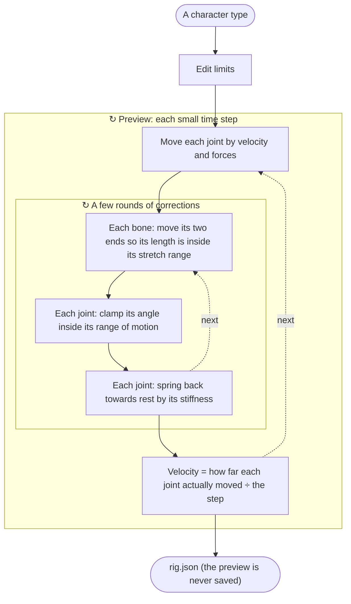
```mermaid
flowchart TD
  s1(["A character type"])
  s2["Edit limits"]
  s1 --> s2
  subgraph s3["↻ Preview: each small time step"]
    s4["Move each joint by velocity and forces"]
    subgraph s5["↻ A few rounds of corrections"]
      s6["Each bone: move its two ends so its length is inside its stretch range"]
      s7["Each joint: clamp its angle inside its range of motion"]
      s6 --> s7
      s8["Each joint: spring back towards rest by its stiffness"]
      s7 --> s8
    end
    s8 -. next .-> s6
    s4 --> s6
    s9["Velocity = how far each joint actually moved ÷ the step"]
    s8 --> s9
  end
  s9 -. next .-> s4
  s2 --> s4
  s10(["rig.json (the preview is never saved)"])
  s9 --> s10
```

- *In:* A character type — It seeds the bones: a human is nineteen, an octopus forty-two.
- Edit limits — Range of motion and stiffness per joint; floppiness and taper per chain. A mirrored edit goes to the twin on the other side.
- **↻ Preview: each small time step**
  - Move each joint by velocity and forces — Gravity, wind, a shove, the body carried about, a drag.
  - **↻ A few rounds of corrections**
    - Each bone: move its two ends so its length is inside its stretch range
    - Each joint: clamp its angle inside its range of motion
    - Each joint: spring back towards rest by its stiffness — Compliance form (XPBD), so the spring’s frequency is the same at any step size.
  - Velocity = how far each joint actually moved ÷ the step
- *Out:* rig.json (the preview is never saved)

### Pseudocode

```
rig = template(character_type)                    # bones, rest pose, limits
for chain in rig.chains:                             # tentacles, tails
  for i, joint in enumerate(chain):
    joint.floppiness = chain.floppiness * (1 - chain.taper * (1 - i / len(chain)))

# the preview: position-based dynamics
every step dt:
  for joint: joint.prev = joint.pos
             joint.vel += dt * forces(joint) / mass
             joint.pos += dt * joint.vel
  repeat iterations:
    for bone: keep |end - start| inside [length * (1 - stretch), length * (1 + stretch)]
    for joint: clamp angle(joint) to its range of motion        # hard stop
    for joint: pull angle towards rest with compliance(stiffness) / dt²
  for joint: joint.vel = (joint.pos - joint.prev) / dt
```

### Two kinds of limit

A **range of motion** is a hard stop: a knee that bends backwards is broken, and no force should get it there. **Stiffness** is a cost: how strongly a joint pulls back to rest. A shoulder and a neck have similar ranges and very different stiffness — most of what makes one character move like a person and another like a puppet.

### Chains

A tentacle is one behaviour, not eight independently tuned joints, so it gets one number: **floppiness**, what the tip does. **Taper** is how much of that the base gives up — at 1 the base does not move at all. Any single joint can still be given its own values.

### Position-based dynamics

Instead of computing forces for the constraints, PBD moves the joints freely and then **projects** them back: a bone that got too long has its ends moved together, a joint bent past its range is clamped. Hard stops are applied in full every step, so they never give. Stiffness is a soft constraint in the compliance form (XPBD): a stiffness of 1 springs back about four times a second, 0.5 twice, 0 not at all, however many steps the preview takes.

### Settings

| Setting | What it changes |
| --- | --- |
| Range of motion | The hard stops of each joint, in degrees from rest. |
| Stiffness | How strongly a joint springs back to rest. |
| Floppiness / Taper | A chain’s looseness at the tip, and how much stiffer the base is. |
| Mirror | An edit to one side goes to its twin on the other. |

**Cost:** Bones × correction rounds per step: trivially fast for a skeleton.

### Further reading

- [Position Based Dynamics (Müller et al.)](https://matthias-research.github.io/pages/publications/posBasedDyn.pdf) — The method the preview uses.
- [XPBD](https://matthias-research.github.io/pages/publications/XPBD.pdf) — The compliance form that makes stiffness independent of the step size.
- [Skeletal animation](https://en.wikipedia.org/wiki/Skeletal_animation) — Bones, hierarchies and rest poses.

*Code:* `packages/shared/src/flows/rig.ts — templates, limits, chains, mirroring`, `packages/shared/src/flows/rigSim.ts — the preview`

## Rig Binding

**Binding a drawing to a skeleton, node by node** · `animation.bind`

Binding maps the points a drawing is drawn through — its nodes — to bones. A node is a position, not a point of one shape: shapes that share a boundary share its points, and they are one node, bound once. The rig is first fitted inside the drawing (scaled by the tighter dimension and centred), then drawing and skeleton are lined up by hand, and nodes are given to bones with a brush, an area or a click. A check finds nodes bound to nothing and shapes split between bones.

### The steps

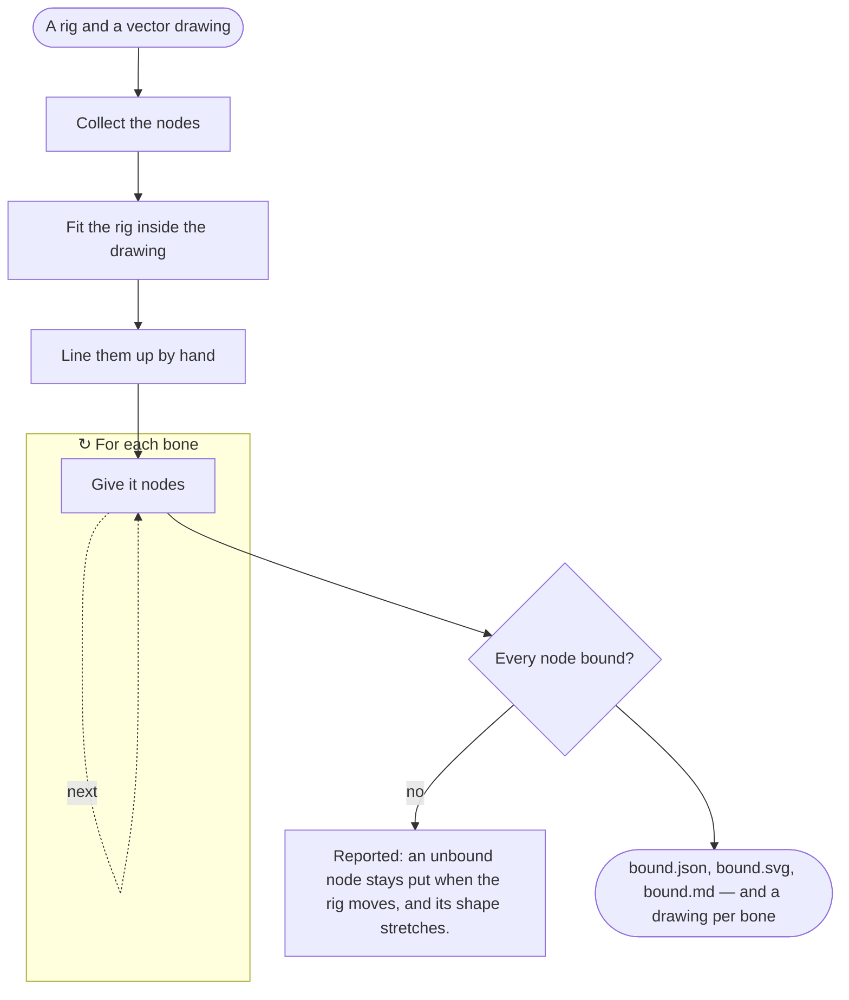
```mermaid
flowchart TD
  s1(["A rig and a vector drawing"])
  s2["Collect the nodes"]
  s1 --> s2
  s3["Fit the rig inside the drawing"]
  s2 --> s3
  s4["Line them up by hand"]
  s3 --> s4
  subgraph s5["↻ For each bone"]
    s6["Give it nodes"]
  end
  s6 -. next .-> s6
  s4 --> s6
  s7{"Every node bound?"}
  s8["Reported: an unbound node stays put when the rig moves, and its shape stretches."]
  s7 -- no --> s8
  s6 --> s7
  s9(["bound.json, bound.svg, bound.md — and a drawing per bone"])
  s7 --> s9
```

- *In:* A rig and a vector drawing
- Collect the nodes — Every point of every shape, keyed by position: points in the same place are one node.
- Fit the rig inside the drawing — Scaled by whichever dimension is tighter, keeping its proportions, and centred.
- Line them up by hand — Move and zoom the drawing and the skeleton independently; drag joints.
- **↻ For each bone**
  - Give it nodes — Brush over them, draw an area round them, or click.
- **Every node bound?** *If not:* Reported: an unbound node stays put when the rig moves, and its shape stretches.
- *Out:* bound.json, bound.svg, bound.md — and a drawing per bone

### Pseudocode

```
nodes = {}
for shape in drawing: for point in shape: nodes[key(point)] += (shape, point)

rig = fit_inside(rig, drawing.bounds)         # scale by tighter side, centre
# ... placed and adjusted by hand ...

bind(keys, bone):   for k in keys: binding[k] = bone
brush(at, r):       bind(nodes within r of at, current bone)
area(polygon):      bind(nodes inside polygon, current bone)

bound = { rig, drawing, points: for each shape, the bone of each point }
parts_by_bone = group shapes by the bone most of their points follow
```

### By node, not by shape

A shape is often bigger than a body part — a whole skin-coloured arm and hand can be one polygon. Bound by its points it can go several ways: the points round the upper arm follow the upper arm, the ones round the hand follow the hand, and the polygon bends at the elbow instead of having to be cut there.

### A node is a position

Neighbouring shapes share the points along their boundary. Two points in the same place are one node, bound once — so a boundary can never be given two bones and torn apart when the rig moves.

### Placed by hand

The drawing and skeleton arrive in different spaces. An automatic fit gets them roughly on top of each other; lining the skeleton up with *this* drawing’s shoulders and hips is done by hand, moving each independently.

### Settings

| Setting | What it changes |
| --- | --- |
| Brush | The radius of the binding brush. |
| Show only this bone | Hide the other bones’ nodes while working. |

### Further reading

- [Skinning](https://en.wikipedia.org/wiki/Skeletal_animation#Technique) — Binding a drawing (or mesh) to bones.

*Code:* `packages/shared/src/flows/rigBind.ts — nodesOf, fitRigTo, bindNodes, boundRigOf`, `packages/shared/src/flows/rigBindCheck.ts`

## Pose

**Posing: angles down the tree (FK), and dragging a hand to a target (IK)** · `animation.pose`

A pose is one angle per bone: its turn from rest. Forward kinematics places every bone by adding each turn to its parents’ and rotating its rest offset by the total. Inverse kinematics — dragging a bone’s tip to a point — uses cyclic coordinate descent: from the joint nearest the tip back up the chain, each joint turns to point the tip at the target, clamped to its range, round and round until close enough.

### The steps

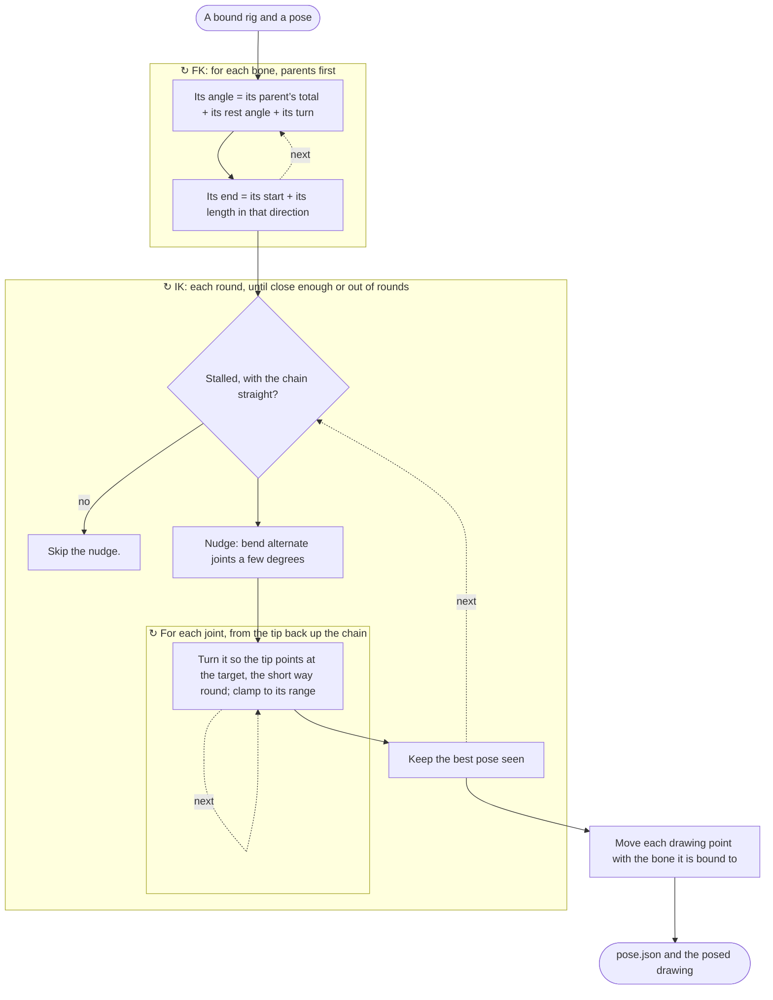
```mermaid
flowchart TD
  s1(["A bound rig and a pose"])
  subgraph s2["↻ FK: for each bone, parents first"]
    s3["Its angle = its parent’s total + its rest angle + its turn"]
    s4["Its end = its start + its length in that direction"]
    s3 --> s4
  end
  s4 -. next .-> s3
  s1 --> s3
  subgraph s5["↻ IK: each round, until close enough or out of rounds"]
    s6{"Stalled, with the chain straight?"}
    s7["Skip the nudge."]
    s6 -- no --> s7
    s8["Nudge: bend alternate joints a few degrees"]
    s6 --> s8
    subgraph s9["↻ For each joint, from the tip back up the chain"]
      s10["Turn it so the tip points at the target, the short way round; clamp to its range"]
    end
    s10 -. next .-> s10
    s8 --> s10
    s11["Keep the best pose seen"]
    s10 --> s11
  end
  s11 -. next .-> s6
  s4 --> s6
  s12["Move each drawing point with the bone it is bound to"]
  s11 --> s12
  s13(["pose.json and the posed drawing"])
  s12 --> s13
```

- *In:* A bound rig and a pose
- **↻ FK: for each bone, parents first**
  - Its angle = its parent’s total + its rest angle + its turn
  - Its end = its start + its length in that direction
- **↻ IK: each round, until close enough or out of rounds**
  - **Stalled, with the chain straight?** *If not:* Skip the nudge.
  - Nudge: bend alternate joints a few degrees — Fixed, not random, so the same drag gives the same pose.
  - **↻ For each joint, from the tip back up the chain**
    - Turn it so the tip points at the target, the short way round; clamp to its range
  - Keep the best pose seen
- Move each drawing point with the bone it is bound to
- *Out:* pose.json and the posed drawing

### Pseudocode

```
def fk(rig, pose):
  for bone in rig in parent-first order:
    angle[bone] = angle[parent] + rest_angle[bone] + pose[bone]
    start[bone] = end[parent] (or the rig's origin)
    end[bone]   = start[bone] + length[bone] * (cos angle, sin angle)

def ik(rig, pose, tip, target, chain_length):
  chain = tip and its parents, chain_length long
  best = pose
  for round in 1..iterations:
    if stalled: bend alternate joints by ±8° × nudge
    for joint in chain (tip first):
      p = start of joint; t = end of tip
      turn = angle(target - p) - angle(t - p), wrapped to [-180, 180]
      pose[joint] = clamp(pose[joint] + turn, joint's range)
    if distance(tip, target) < best: best = pose
    if close enough: break
  return best
```

### Angles, not positions

A pose stores how far each bone has turned, not where it is. Positions would be a drawing of one arrangement; angles are the arrangement itself: they survive the rig being edited underneath, interpolate sensibly between two poses, and cannot describe a skeleton that has come apart.

### Forward kinematics

A bone’s turn is added to everything its parents have done, and its rest offset rotated by the total. That is why the whole arm lifts when the shoulder turns, without the elbow being told anything.

### Cyclic coordinate descent

CCD rather than a Jacobian solver: joint limits are a clamp rather than a constraint to solve around, each step is a couple of angle calculations, and a chain that cannot reach settles stretched towards the target instead of oscillating. Its weak spot — a straight chain aimed along itself, where each joint’s correction is tiny — is broken by a small fixed bend when progress stalls. The best pose seen is the one returned, so a solve never makes things worse.

### Settings

| Setting | What it changes |
| --- | --- |
| Chain length | How many bones up from the dragged one IK may turn. |
| Respect limits | Clamp every joint to its range of motion. |

**Cost:** FK is one pass over the bones. IK is rounds × chain length × one FK.

### Further reading

- [Forward kinematics](https://en.wikipedia.org/wiki/Forward_kinematics) — Placing a chain from its joint angles.
- [Inverse kinematics](https://en.wikipedia.org/wiki/Inverse_kinematics) — The reverse problem, and the ways to solve it.
- [Cyclic coordinate descent (Kenwright)](https://arxiv.org/abs/1311.6311) — An accessible account of CCD for character chains.

*Code:* `packages/shared/src/flows/pose.ts — posedBones, solveIk, posedImage`

## Rig Parts

**Taking a bound drawing apart: each shape to the bone most of it follows** · `animation.parts`

Each shape of the bound drawing goes to the bone that most of its points follow; shapes whose points follow nothing go to a “Not bound” part. Each part is the shapes of one bone, drawn the size of the whole drawing so the parts lie back over one another exactly. Shapes can then be moved between parts and each part’s drawing edited.

### The steps

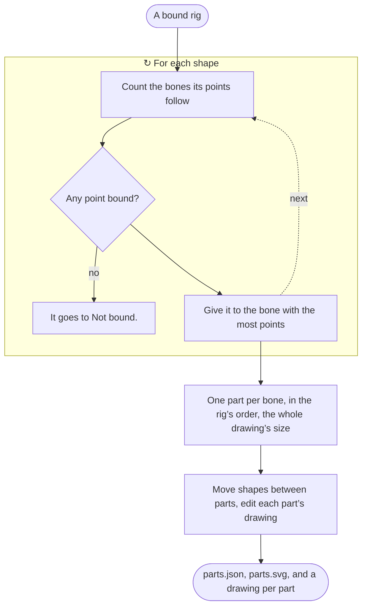
```mermaid
flowchart TD
  s1(["A bound rig"])
  subgraph s2["↻ For each shape"]
    s3["Count the bones its points follow"]
    s4{"Any point bound?"}
    s5["It goes to Not bound."]
    s4 -- no --> s5
    s3 --> s4
    s6["Give it to the bone with the most points"]
    s4 --> s6
  end
  s6 -. next .-> s3
  s1 --> s3
  s7["One part per bone, in the rig’s order, the whole drawing’s size"]
  s6 --> s7
  s8["Move shapes between parts, edit each part’s drawing"]
  s7 --> s8
  s9(["parts.json, parts.svg, and a drawing per part"])
  s8 --> s9
```

- *In:* A bound rig
- **↻ For each shape**
  - Count the bones its points follow
  - **Any point bound?** *If not:* It goes to Not bound.
  - Give it to the bone with the most points
- One part per bone, in the rig’s order, the whole drawing’s size
- Move shapes between parts, edit each part’s drawing
- *Out:* parts.json, parts.svg, and a drawing per part

### Pseudocode

```
majority_bone(shape):
    votes = {}; best = None; most = 0
    for bone in bound.points[shape]:           # one entry per point, or None
        if bone is None: continue
        votes[bone] += 1
        if votes[bone] > most: most, best = votes[bone], bone   # a tie keeps the first to get there
    return best

for shape in bound.drawing.shapes:            # in drawing order
    by_bone[majority_bone(shape) or NOT_BOUND] += shape

parts = [Part(bone, by_bone[bone], size = whole drawing)
         for bone in rig.bones if bone in by_bone]
if NOT_BOUND in by_bone: parts += Part("Not bound", ...)
parts += bones the drawing names but the rig no longer has
```

### The majority

A shape bound by its points may follow several bones — that is how an arm bends at the elbow. As a part it has to belong to one, so it goes with the bone most of its points follow. Where that is wrong, move it by hand.

### The whole drawing’s size

Every part’s drawing keeps the size and coordinates of the whole, so the parts lie back over one another exactly and can be swapped or animated in place.

### Further reading

- [Cut-out animation](https://en.wikipedia.org/wiki/Cutout_animation) — Animation from separate parts, which is what this prepares.

*Code:* `packages/shared/src/flows/rigParts.ts — majorityBone, splitIntoParts`

## Face Parts

**Finding the features of a face from where shapes sit, their size, shape and colour** · `animation.face`

The face is the big low shape the others sit on. Every other shape is placed on it — across from left to right, down from top to chin — and sized against it. Then rules, in order, name the hair, ears, eyes (the best mirrored pair), eyebrows, mouth and nose. Anything left is unassigned, for you to give to a feature; each feature can then be hidden, isolated, nudged or swapped with the same feature of another head.

### The steps

```mermaid
flowchart TD
  s1(["A head: a drawing, or the head parts of a Rig Parts file"])
  s2["The face"]
  s1 --> s2
  s3["Place everything on the face"]
  s2 --> s3
  s4["Hair"]
  s3 --> s4
  s5["Ears"]
  s4 --> s5
  subgraph s6["↻ Eyes: each pair of candidate shapes in the upper middle"]
    s7["Score it"]
    s8{"Level, mirrored and alike enough?"}
    s9["Not a pair of eyes."]
    s8 -- no --> s9
    s7 --> s8
  end
  s8 -. next .-> s7
  s5 --> s7
  s10["Keep the best pair; what is inside an eye is part of it"]
  s8 --> s10
  s11["Eyebrows: above each eye, wider than tall"]
  s10 --> s11
  s12["Mouth: middle, below the eyes, the widest thing wider than tall"]
  s11 --> s12
  s13["Nose: middle, between the eyes and the mouth"]
  s12 --> s13
  s14(["face.json, each head redrawn, and each feature drawn alone"])
  s13 --> s14
```

- *In:* A head: a drawing, or the head parts of a Rig Parts file
- The face — Of the polygons at least a third the size of the largest, the lowest.
- Place everything on the face — Across 0 (left) to 1 (right), down 0 (top) to 1 (chin), and size against it.
- Hair — Sizeable, reaching the top, out above or beside the face or across it as a fringe, not the face’s colour.
- Ears — At the face’s sides, halfway down, smaller than hair.
- **↻ Eyes: each pair of candidate shapes in the upper middle**
  - Score it — 2 × how unlevel + 2 × how unmirrored + ½ × size difference + 2 × colour difference + how far from the eye line.
  - **Level, mirrored and alike enough?** *If not:* Not a pair of eyes.
- Keep the best pair; what is inside an eye is part of it
- Eyebrows: above each eye, wider than tall
- Mouth: middle, below the eyes, the widest thing wider than tall
- Nose: middle, between the eyes and the mouth
- *Out:* face.json, each head redrawn, and each feature drawn alone

### Pseudocode

```
face = lowest of polygons with area >= largest / 3
for s in other shapes: s.u, s.v = position across / down the face; s.size = area / face.area
hair  = shapes reaching the top, big, outside or across the top, colour != face
ears  = shapes at u ≈ 0 or 1, v ≈ 0.5, smaller than hair
eyes  = argmin over pairs (a, b) in the upper middle of
        2*|a.v - b.v| + 2*|a.u + b.u - 1| + 0.5*size_diff + 2*colour_gap + 0.5*|mean v - 0.42|
        where level < 0.12, mirror < 0.15, size_diff < 1.2, and not long and thin
eyebrows = above each eye, wider than tall
mouth = middle, below the eyes, widest wider-than-tall shape (with what is inside it)
nose  = middle, between eyes and mouth
everything else: unassigned
```

### Rules, not learning

A face drawn for animation follows conventions: eyes are a level mirrored pair above the middle, the mouth is wide and low, the nose between them. Reading those from where a shape is, how big, what shape and what colour is enough for most drawn heads — and every rule is one you can read and correct by hand.

### Swapping

A feature can be swapped for the same feature of another head: its shapes are fitted into the place this head’s own feature was, so two heads can trade eyes or mouths.

### Further reading

- [Facial symmetry](https://en.wikipedia.org/wiki/Facial_symmetry) — Why a mirrored pair is the strongest clue to the eyes.

*Code:* `packages/shared/src/flows/face.ts — identifyFace, composeFeature, composeHead`

## Corpus

**Gathering text into one body** · `text.corpus`

A corpus is the text the word and grammar databases read. It is a list of parts: text you pasted, the built-in sample, or an address fetched each time the flow runs, plus any text wired in. A run reads the included parts in order, trims each, and joins them with the separator. A part that cannot be read is noted on the part and skipped, so one dead link does not lose the rest.

### The steps

```mermaid
flowchart TD
  s1(["Parts, in order"])
  subgraph s2["↻ For each included part"]
    s3{"Does it carry its own text?"}
    s4["Fetch the address (http/https only, no private hosts), up to 8 MB."]
    s3 -- no --> s4
    s5{"Was it read?"}
    s6["Record the error on the part, warn, and go on to the next."]
    s5 -- no --> s6
    s3 --> s5
    s7["Note its size on the part"]
    s5 --> s7
  end
  s7 -. next .-> s3
  s1 --> s3
  s8["Add text from wires"]
  s7 --> s8
  s9["Trim each piece, drop empty ones, join with the separator"]
  s8 --> s9
  s10(["corpus.txt and report.md"])
  s9 --> s10
```

- *In:* Parts, in order — Pasted, built in, or an address; and text on the Text input.
- **↻ For each included part**
  - **Does it carry its own text?** — Pasted and built-in parts do. *If not:* Fetch the address (http/https only, no private hosts), up to 8 MB.
  - **Was it read?** *If not:* Record the error on the part, warn, and go on to the next.
  - Note its size on the part — So the editor can show a size without fetching again.
- Add text from wires — Read fresh on every run, never stored.
- Trim each piece, drop empty ones, join with the separator
- *Out:* corpus.txt and report.md

### Pseudocode

```
pieces = []
for part in included_parts(data):          # in the order they are listed
    if part.kind in (pasted, builtin):
        text = part.text
    else:
        try:  text = fetch(guarded(part.url), limit=8 MB)
        except error:
            part.last_error = error; continue
    part.last_bytes = len(text)
    pieces.append(text)

for wire into the Text port:
    pieces.append(read(wire))                # fresh every run

corpus = separator.join(p.strip() for p in pieces if p.strip())
```

### Why a corpus is its own flow

The word database and the grammar database both read text. When each kept its own copy, the two could read different books, and then their word types would not line up. One corpus wired into both means they read the same words.

### Addresses are fetched, not stored

A novel is a megabyte, and a project is a folder you copy around. So a part with an address keeps only the address, and the text is fetched when the flow runs. Only the size and the last error are remembered.

The fetch refuses anything but http and https, and refuses localhost and private network ranges. A very large file is cut off and a warning says so.

### What the separator is for

Parts are joined with a blank line by default. Without it, the last sentence of one book and the first of the next would run together. The word counter would then count a pair of words that never stood side by side.

### Settings

| Setting | What it changes |
| --- | --- |
| Included / order | Only ticked parts are written, in the order shown. |
| Separator | Written between parts. A blank line ends a paragraph, so the counters do not link across parts. |

**Cost:** One fetch per address part per run; joining is linear in the text size.

### Further reading

- [Project Gutenberg](https://www.gutenberg.org/) — Free public-domain books, a good source of corpus text.
- [Text corpus (Wikipedia)](https://en.wikipedia.org/wiki/Text_corpus) — What a corpus is and how it is used in language work.

*Code:* `packages/shared/src/flows/corpusFlow.ts`, `packages/server/src/generators/corpus.ts`, `packages/server/src/text/corpusFetch.ts`

## Word Database

**Counting words, and the company they keep** · `text.lexicon`

The word database reads a corpus and counts two things for every word: how often it appears, and which words turn up near it. Datasets are kept as raw counts, so adding or removing a book is exact addition or subtraction. When the master database is built, frequency becomes a log scale from 0 to 1. Each word’s contexts are weighted by lift: how much more often a word keeps this one company than it turns up at all. That is what stops "the" being the strongest context of every word.

### The steps

```mermaid
flowchart TD
  s1(["A corpus"])
  s2["Split into tokens"]
  s1 --> s2
  subgraph s3["↻ For each token"]
    s4["count[token] += 1"]
    s5{"Same paragraph as the token before?"}
    s6["A blank line breaks the chain: no pair is counted."]
    s5 -- no --> s6
    s4 --> s5
    s7["pairs[previous][token] += 1"]
    s5 --> s7
  end
  s7 -. next .-> s4
  s2 --> s4
  s8["Keep the most common words"]
  s7 --> s8
  subgraph s9["↻ For each kept word, each other word nearby"]
    s10["Chance = distance chance × rarity"]
    s11{"Does the seeded roll pass?"}
    s12["Not taken this time."]
    s11 -- no --> s12
    s10 --> s11
    s13["Take it into the word’s context slots"]
    s11 --> s13
  end
  s13 -. next .-> s10
  s8 --> s10
  s14["Master = sum of the ticked datasets’ counts"]
  s13 --> s14
  s15["Frequency = log(1 + count) / log(1 + max count)"]
  s14 --> s15
  s16["Context weight = log(lift) / log(lift ceiling)"]
  s15 --> s16
  s17["One entry per sense, then one per form"]
  s16 --> s17
  s18(["lexicon.json"])
  s17 --> s18
```

- *In:* A corpus — Pasted, fetched, the sample, or wired in.
- Split into tokens — Words, numbers, punctuation marks and line breaks.
- **↻ For each token**
  - count[token] += 1
  - **Same paragraph as the token before?** *If not:* A blank line breaks the chain: no pair is counted.
  - pairs[previous][token] += 1
- Keep the most common words — Up to Max words; links below Min pair count are dropped.
- **↻ For each kept word, each other word nearby**
  - Chance = distance chance × rarity — Next to it 0.9, same sentence 0.25, same paragraph 0.05; very common words are taken less.
  - **Does the seeded roll pass?** *If not:* Not taken this time.
  - Take it into the word’s context slots — Already there: weight + 1. A free slot: weight 1. All full: may push out the weakest.
- Master = sum of the ticked datasets’ counts
- Frequency = log(1 + count) / log(1 + max count)
- Context weight = log(lift) / log(lift ceiling) — lift = share of the word’s company ÷ share of the corpus. Only lift > 1 is kept.
- One entry per sense, then one per form — From the dictionary’s answers and the morphology dataset.
- *Out:* lexicon.json

### Pseudocode

```
# counting (once per corpus)
for token in tokenize(text):
    if token is a blank line: previous = None; continue
    count[token] += 1
    if previous: pairs[previous][token] += 1
    previous = token
kept = top(count, max_words)

rng = seeded(corpus name)
for each occurrence of a kept word w at position i:
    for other word o within reach, same paragraph:
        chance = {adjacent: 0.9, sentence: 0.25, paragraph: 0.05}[distance]
        chance *= min(1, common_share / share(o))        # "the" rarely taken
        if rng() < chance: take(slots[w], o)

take(slots, o):
    if o in slots:            slots[o] += 1
    elif free slot:           slots[o] = 1
    else:
        weakest = min(slots)
        if rng() < 1 / (1 + slots[weakest]):  replace weakest with o
    if total weight >= capacity * grow_at: capacity *= 2   (max 128)

# deriving (every time the master changes)
master = sum(counts of ticked datasets)
frequency(w) = log(1 + count[w]) / log(1 + max_count)
for o in slots[w]:
    lift = (slots[w][o] / sum(slots[w])) / (count[o] / total)
    if lift > 1:
        weight = min(1, log(lift) / log(lift_ceiling))
        if weight >= min_weight: contexts[w].append(o, weight)
```

### Counts, never weights

A dataset stores raw counts. That makes the set algebra exact. Two datasets combine by adding counts and come apart by subtracting them, so `subtract(combine(a, b), b)` gives back `a` exactly. Unticking a book is a subtraction, and nothing is lost by it.

Every derived number (frequency, context weight) is recomputed from whatever counts are left.

### Why frequency is a log

Word counts follow Zipf’s law: the commonest word is about twice as common as the second, three times the third, and so on. A raw share would put almost every word near zero. `log(1+count) / log(1+max)` puts the commonest word at 1 and keeps the long tail usable.

### Contexts are sampled, not all counted

Counting every pair of words in the same paragraph would give each word thousands of contexts, mostly noise. Instead each nearby word gets a chance of being taken, and the chance falls with distance and with how common the word is. A word right beside another is almost always taken. One elsewhere in the paragraph is taken one time in twenty.

Each word starts with 16 slots. When all are full, a new context may push out the weakest, and the lighter the weakest is, the likelier. Strong contexts therefore survive and one-off ones get replaced. Once the slots are heavily used, they double, so a word the corpus uses a lot has room for more company.

The random rolls are seeded from the corpus, so counting the same text again gives the same contexts.

### Lift: why "the" is not everyone’s context

If a word is 5% of the corpus and 5% of what sits near "kitchen", it tells you nothing about kitchens. Lift divides the share of a word’s company by the share of the corpus:

- lift 1 means no more often than chance, and the context is dropped;
- lift 12 (the ceiling) or more means full weight, 1.0;
- between the two, the weight grows on a log scale.

This is pointwise mutual information, rescaled to 0..1.

### Senses and forms

Counting cannot tell `light` the noun from `light` the verb. When a dictionary has answered, each sense becomes its own entry with the same counts. Each sense is also given the words of its own definition as extra contexts, so `bank` the river’s edge keeps company with `river` and `bank` the lender with `money`.

Then every form of each word (`cats`, `walked`) gets a row too. A form the corpus never saw has a count of 0.

### Settings

| Setting | What it changes |
| --- | --- |
| Max words | How many distinct tokens are kept, commonest first. |
| Links per word / Min pair count | How many following words are kept per word, and how often a pair must appear to count. |
| Adjacent / sentence / paragraph chance | How likely a word at each distance is to be taken as a context. |
| Context slots / grow at | Starting room for contexts, and how full the slots must be before they double. |
| Lift ceiling | The lift that counts as full strength. Lower it and more contexts reach weight 1. |
| Min weight | Contexts weaker than this after weighting are dropped. |

**Cost:** Linear in the corpus length for counting; about 50 nearby words are rolled per word occurrence. A novel takes a second or two.

**Try it:** Click a word in the database table to see its contexts and their weights.

### Further reading

- [Pointwise mutual information (Wikipedia)](https://en.wikipedia.org/wiki/Pointwise_mutual_information) — Lift is the ratio inside PMI; the log of it is PMI.
- [Zipf’s law (Wikipedia)](https://en.wikipedia.org/wiki/Zipf%27s_law) — Why word frequency needs a log scale.
- [Distributional semantics (Wikipedia)](https://en.wikipedia.org/wiki/Distributional_semantics) — "You shall know a word by the company it keeps": the idea behind contexts.
- [Space-Saving / heavy hitters](https://en.wikipedia.org/wiki/Streaming_algorithm#Frequent_elements) — The slot scheme is a relative of these fixed-memory frequent-item counters.

*Code:* `packages/shared/src/text/corpus.ts`, `packages/shared/src/flows/lexicon.ts`, `packages/shared/src/text/senses.ts`, `packages/shared/src/text/tokenize.ts`

## Dictionary

**Asking a dictionary, and applying the answers** · `text.dictionary`

Counting text tells you how common a word is, but not what kind of word it is. This flow fills that gap. In the editor, it asks a dictionary service about each word, commonest first, in batches with retries and a disk cache. Generating then applies the answers: each sense becomes its own entry, and each word’s forms come from a morphology dataset rather than rules. A word nobody answered for is left exactly as it came in.

### The steps

```mermaid
flowchart TD
  s1(["A word database"])
  s2["Words to ask about"]
  s1 --> s2
  subgraph s3["↻ Lookup (in the editor), a batch of 200 at a time"]
    s4{"On disk already?"}
    s5["Ask the service: 4 at a time, 120 ms apart, 8 s timeout."]
    s4 -- no --> s5
    s6{"Did it answer?"}
    s7["Retry after 0.5 s, 1.5 s, 4 s (or as long as Retry-After says). After 3 words fail outright, stop the batch."]
    s6 -- no --> s7
    s4 --> s6
    s8["Cache the senses; look up the forms in the morphology dataset"]
    s6 --> s8
  end
  s8 -. next .-> s4
  s2 --> s4
  subgraph s9["↻ Generate: for each spelling in the database"]
    s10{"Was anything learned about it?"}
    s11["Keep every row exactly as it came in."]
    s10 -- no --> s11
    s12["Match each sense to a row of the same type"]
    s10 --> s12
    s13["A sense with no row gets a new entry"]
    s12 --> s13
    s14["Set type, description and forms from the sense"]
    s13 --> s14
  end
  s14 -. next .-> s10
  s8 --> s10
  s15["Drop form rows whose word changed type"]
  s14 --> s15
  s16["Add a row for every form"]
  s15 --> s16
  s17(["The improved word database"])
  s16 --> s17
```

- *In:* A word database
- Words to ask about — Not forms, not marks or numbers, at least Min frequency, not already answered (unless Refresh). Commonest first.
- **↻ Lookup (in the editor), a batch of 200 at a time**
  - **On disk already?** *If not:* Ask the service: 4 at a time, 120 ms apart, 8 s timeout.
  - **Did it answer?** — A 404 is an answer: "not a word it knows". *If not:* Retry after 0.5 s, 1.5 s, 4 s (or as long as Retry-After says). After 3 words fail outright, stop the batch.
  - Cache the senses; look up the forms in the morphology dataset
- **↻ Generate: for each spelling in the database**
  - **Was anything learned about it?** *If not:* Keep every row exactly as it came in.
  - Match each sense to a row of the same type — The first sense takes the first row, so context links keep pointing at it.
  - A sense with no row gets a new entry — Split senses on: light (noun), light (verb), light (adjective).
  - Set type, description and forms from the sense
- Drop form rows whose word changed type — Unless the corpus counted them: then they are words in their own right.
- Add a row for every form — If Add variants is on.
- *Out:* The improved word database

### Pseudocode

```
# lookup (editor, resumable)
queue = [w for w in database by frequency desc
         if not form and lookup_candidate(w) and freq >= min
         and (refresh or w not in answers)]
for batch of 200 in queue:
    for w in batch (4 workers, 120 ms pause):
        if cached(w): answer = cache[w]; continue
        for delay in [0, 500, 1500, 4000]:          # or Retry-After
            response = get(provider_url(w))          # key never logged
            if ok or 404: cache[w] = senses(response); break
            wait(delay)
        else: failures += 1
        if failures >= 3: stop batch, report what is left

# generate (instant, repeatable)
for spelling, rows in group_by_spelling(database):
    senses = answers[spelling] (first only unless split_senses)
    if not senses: keep rows; continue
    for i, sense in enumerate(senses):
        row = row with type == sense.type
              or (i == 0 and first unclaimed row)
              or new row(id = allocate(spelling, sense.type))
        row.type, row.description = sense.type, sense.description
        row.forms = morphology[spelling][sense.type]
drop derived forms whose root changed type (unless counted)
if add_variants: add a row per form
```

### Why looking up and generating are separate

Asking a service about thousands of words is slow, rate-limited and sometimes refused. So the asking happens in the editor, with a progress bar and a Stop button, and everything learned is cached on disk. Generating only applies what is known, so it is instant and repeatable. A lookup stopped halfway is still worth generating.

### A spelling is not a word

`light` is a noun, a verb and an adjective, and means something different as each. If one row held only the first sense, a grammar flow would put `light` where only a noun fits. With Split senses on, every sense the dictionary reports becomes its own entry.

The first sense keeps the plain id. That matters, because context links counted from the corpus point at the plain id and know nothing about senses.

### Forms come from data, not rules

No dictionary service returns inflections, and working them out by rule was wrong too often (`forgive` → `forgived`, `cactus` → `cactu`). So forms come from a morphology dataset. It is downloaded once, indexed, and answers from disk. Switching datasets re-indexes but does not re-ask the dictionary.

When a word changes type, its forms change too. `walks` is a plural while `walk` is a noun, but the third person singular once `walk` is a verb.

### Being polite to the service

A batch sends at most 200 requests, 4 at a time with a short pause. A refused request is retried with growing waits, and if the service sends Retry-After, that wait is used instead. After three words fail outright, the batch stops rather than firing hundreds of requests that will fail too.

API keys are stored only on the server, never sent to the browser, and masked in the log.

### Settings

| Setting | What it changes |
| --- | --- |
| Provider | Which dictionary service is asked. One that needs a key it does not have cannot be picked. |
| Morphology dataset | Where word forms come from. |
| Min frequency | Skip rare words, so a long tail does not take all day. |
| Refresh | Ask again about words already answered. |
| Overwrite types / descriptions | Replace what the incoming database already had. |
| Split senses | One entry per meaning, or only the first. |
| Add variants | Give every form its own row. |

**Cost:** About 5 words a second with the defaults on an uncached run; cached words cost nothing. Generating is instant.

### Further reading

- [Free Dictionary API](https://dictionaryapi.dev/) — The keyless default service.
- [Exponential backoff (Wikipedia)](https://en.wikipedia.org/wiki/Exponential_backoff) — The retry scheme, and why waits grow.
- [Inflection (Wikipedia)](https://en.wikipedia.org/wiki/Inflection) — What word forms are, and why English ones are irregular.

*Code:* `packages/shared/src/flows/dictionary.ts`, `packages/server/src/text/dictionary.ts`, `packages/server/src/text/morphology.ts`, `packages/shared/src/text/senses.ts`

## Grammar Database

**Sentence shapes, counted** · `text.grammar`

The grammar database reads a corpus against a word database and counts shapes. Each token is tagged with its type (and form) from the word database, for example `determiner adjective noun verb:past punctuation:.`. The flow counts three kinds of pattern: whole sentences, the fragments between commas and joining words, and every short run of 2 to 5 slots. The random text flow uses these to choose a sentence shape and to score how well each word continues the last few.

### The steps

```mermaid
flowchart TD
  s1(["A corpus and a word database"])
  s2["Tag each token"]
  s1 --> s2
  s3["Split into sentences"]
  s2 --> s3
  subgraph s4["↻ For each sentence"]
    s5{"Did it end with its own full stop?"}
    s6["A heading or unfinished line: its shape is not kept, but its fragments still are."]
    s5 -- no --> s6
    s7["Count the whole shape, and its length in words"]
    s5 --> s7
    s8["Split at commas and conjunctions into fragments; count each"]
    s7 --> s8
    s9["Count every run of 2–5 slots inside each fragment"]
    s8 --> s9
  end
  s9 -. next .-> s5
  s3 --> s5
  s10["Keep the commonest"]
  s9 --> s10
  s11(["grammar.json"])
  s10 --> s11
```

- *In:* A corpus and a word database
- Tag each token — Type and form from the word database. A word it does not know is tagged unknown, not guessed.
- Split into sentences — "Mr." and initials do not end one; a blank line does.
- **↻ For each sentence**
  - **Did it end with its own full stop?** *If not:* A heading or unfinished line: its shape is not kept, but its fragments still are.
  - Count the whole shape, and its length in words
  - Split at commas and conjunctions into fragments; count each
  - Count every run of 2–5 slots inside each fragment
- Keep the commonest — Sentence shapes are shared out between lengths in proportion to how often each length was written.
- *Out:* grammar.json

### Pseudocode

```
for sentence in sentences(tokenize(text)):
    slots = [tag(t) for t in sentence]   # e.g. "determiner", "verb:past", "punctuation:."
    if sentence.closed:
        lengths[words_in(slots)] += 1
        if len(slots) <= max_sentence_slots:
            sentences[signature(slots)] += 1
    for fragment in split_at_commas_and_conjunctions(slots):
        fragments[signature(fragment)] += 1
        for size in 2..5:
            for each run r of that size in fragment:
                phrases[signature(r)] += 1

# keep: sentence shapes by length quota, the rest commonest first
quota(length) = max(3, max_patterns * share_of_sentences(length))

# used by random text
continuations[first n-1 slots][last slot] += count     # from phrases
score(next | recent) = share of the longest matching run
```

### Why it needs a word database

A shape is made of word types, and the word database is the only authority on types. A token it has never seen is tagged `unknown` rather than guessed. It still takes a place in the pattern, so an unfamiliar word does not break its sentence.

Forms matter too. If the word database has its forms filled in, `walked` is tagged `verb:past`, not just `verb`, and the grammar is far more detailed.

### Three sizes of pattern

- **Sentences:** the whole shape, used to choose what a new sentence looks like.
- **Fragments:** the pieces between commas and joining words, used to write a clause into existing text.
- **Phrases:** every run of 2 to 5 slots, turned into a table of what comes next after each run. This is an n-gram model over word types rather than words.

### Length first, then shape

Short shapes repeat word for word far more often than long ones. Choosing shapes by count alone made one-word sentences many times commoner than the corpus had them. So the generator picks in two draws: first a length, by how often the corpus wrote sentences of that length, then a shape of that length.

For the same reason, the kept shapes are shared out between lengths in proportion to how often each was written.

### Scoring a continuation

To score a candidate word, the generator looks for the longest run of recent slots (up to 4) that the grammar has seen. It asks what share of that run’s continuations match the candidate’s slot. A match on type alone (a verb, but in another tense) counts for 0.6. A longer match counts for more.

### Settings

| Setting | What it changes |
| --- | --- |
| Max sentence slots | Longer sentences are counted by length but their shape is not kept. |
| Phrase min / max | The shortest and longest runs counted as phrases. |
| Max patterns / min count | How many of each kind are kept, and how often one must appear. |
| Use forms | Slots carry the form (verb:past) or only the type (verb). |

**Cost:** Linear in the corpus: each fragment of n slots adds about 4n phrase counts.

### Further reading

- [Part-of-speech tagging (Wikipedia)](https://en.wikipedia.org/wiki/Part-of-speech_tagging) — What tagging is. This flow does the simplest kind: a lookup.
- [n-gram (Wikipedia)](https://en.wikipedia.org/wiki/N-gram) — The phrase table is an n-gram model over word types.
- [Speech and Language Processing, ch. 3 and 8 (Jurafsky & Martin)](https://web.stanford.edu/~jurafsky/slp3/) — A free textbook on n-gram models and tagging.

*Code:* `packages/shared/src/text/grammarDatabase.ts`, `packages/shared/src/flows/grammar.ts`

## Random Text

**Writing one word at a time** · `text.random`

Random text writes by picking one word at a time from the word database. Every candidate gets a score. Word frequency is the starting point. That is multiplied up by how strongly the last few words point at the candidate, and multiplied down by how poorly its type follows the previous type. A grammar database, when wired in, adds a sentence shape to fill and a score for how well the candidate continues the last few slots. Repeats are penalised. The draw is weighted by score, sharpened by temperature, and seeded, so the same settings always write the same text.

### The steps

```mermaid
flowchart TD
  s1(["A word database; maybe a grammar database and text"])
  s2{"Mode after / from nothing?"}
  s3["Within: write words, phrases and fragments into gaps. Alter: replace a share of the words, then grow or trim to length."]
  s2 -- no --> s3
  s1 --> s2
  s4["Plan a length"]
  s2 --> s4
  subgraph s5["↻ Until the length is reached"]
    s6{"Room left in this sentence?"}
    s7["End it with a full stop and start the next."]
    s6 -- no --> s7
    s8["Next slot from the sentence shape"]
    s6 --> s8
    s9["Gather candidates"]
    s8 --> s9
    s10["Score each candidate"]
    s9 --> s10
    s11["Draw one, weighted by score^(1/temperature)"]
    s10 --> s11
    s12["Spell it for the slot"]
    s11 --> s12
  end
  s12 -. next .-> s6
  s4 --> s6
  s13["Finish the sentence if there is room; close it"]
  s12 --> s13
  s14(["Text, with each token marked kept / replaced / added"])
  s13 --> s14
```

- *In:* A word database; maybe a grammar database and text
- **Mode after / from nothing?** *If not:* Within: write words, phrases and fragments into gaps. Alter: replace a share of the words, then grow or trim to length.
- Plan a length — A target and a tolerance, in words or characters.
- **↻ Until the length is reached**
  - **Room left in this sentence?** — Fewer words than the most a sentence may have. *If not:* End it with a full stop and start the next.
  - Next slot from the sentence shape — A new shape is drawn when one runs out: length first, then shape.
  - Gather candidates — Everything the last few words point at, plus the commonest words, up to 400.
  - Score each candidate — prior × context × grammar × punctuation × slot × continuation × repeat penalty.
  - Draw one, weighted by score^(1/temperature)
  - Spell it for the slot — A past-tense slot gets "walked", if the database has that form.
- Finish the sentence if there is room; close it
- *Out:* Text, with each token marked kept / replaced / added

### Pseudocode

```
rng = mulberry32(seed)
while length(text) < goal:
    slot = next slot of current sentence shape (or None)
    for c in candidates(history):                     # ≤ 400
        prior   = c.frequency ^ lerp(0.4, 3, frequency_bias)
        pull    = Σ_back decay^back · max(fwd[prev][c], sym · fwd[c][prev])
                  / Σ decay^back                     # last context_window words
        context = 1 + 14·(1 − frequency_bias) · pull
        grammar = follow(prev_type → c.type) ^ (3 · grammar_bias)
        punct   = 0 for a mark after a mark; full stop grows with sentence progress
        shape   = 1 if c.type == slot.type else (1 − grammar_weight)^3
        cont    = 1 + 6 · grammar_weight · continuation(recent_slots, slot_of(c))
        repeat  = 0.1 .. 1 if c was used in the last 6 words
        score[c] = prior · context · grammar · punct · shape · cont · repeat
    word = draw(candidates, weight = score ^ (1 / pick_temperature), rng)
    text += spell_for_slot(word, slot)
```

### Frequency is the prior, context multiplies it, grammar filters it

Without context, the commonest words would win every time. **Frequency bias** slides between two readings. At 0, every word is about equally likely before context, and context decides everything. At 1, common words dominate and context is ignored.

The context pull reads the last few words, each counting less the further back it is (`contextDecay`). A context read backwards (`tree` listing `apple` rather than `apple` listing `tree`) counts for `contextSymmetry` of the forward weight.

### Two kinds of grammar

- **Grammar bias** uses a fixed table of how readily one word type follows another (a determiner is followed by a noun or an adjective). It is blunt, but it keeps "the the quiet of" from happening.
- **Grammar weight** uses a wired-in grammar database. It supplies a sentence shape whose slots each candidate should fill, and a continuation score from the phrases the corpus actually used.

When writing into existing text, a candidate also has to fit the word after it, not only the one before.

### Temperature

Scores are raised to the power 1/temperature before the draw. At 1 the draw is proportional to score. Towards 0 the best candidate wins almost every time, so the text is more predictable and repeats itself more. The same trick sharpens the choice of sentence shape.

### Seeded, so it is repeatable

Every random choice comes from a seeded generator (mulberry32). The same database, settings and seed always give the same text, so the graph only marks the flow stale when something real changed. Rerolling means changing the seed, which is an edit you can see and undo.

### Alter and within

In **alter** mode, a share of the words (the alter temperature) is replaced by a word, phrase or fragment that reads on from what is before and into what is after. The text is then grown or trimmed towards the target length. When trimming, adverbs and adjectives go first and determiners and pronouns last, so the sentence structure survives.

In **within** mode, nothing that came in is changed. New words, phrases and fragments are set into gaps after words until the text is long enough.

### Settings

| Setting | What it changes |
| --- | --- |
| Mode | After (write on), within (write into gaps), or alter (replace words). |
| Seed | Same seed, same text. |
| Pick temperature | Lower is safer and more repetitive; higher is more varied. |
| Context window / decay / symmetry | How many words back the context reads, how fast each step back fades, and how much a backwards link counts. |
| Frequency bias | From context decides everything (0) to common words win (1). |
| Grammar bias / grammar weight | Strength of the built-in type table, and of the wired grammar database. |
| Sentence words / length | Fewest and most words a sentence may have, and the length it aims for. |
| Units | How often within and alter write a word, a phrase or a fragment. |

**Cost:** About 400 candidates scored per word: a few thousand words a second.

**Try it:** Change the seed or the pick temperature and generate again; replaced and added words are highlighted.

### Further reading

- [Markov text generators (Wikipedia)](https://en.wikipedia.org/wiki/Markov_chain#Markov_text_generators) — The simplest version of the same idea.
- [Softmax temperature](https://en.wikipedia.org/wiki/Softmax_function#Applications) — Why raising scores to 1/T sharpens or flattens a draw.
- [Weighted random sampling](https://en.wikipedia.org/wiki/Reservoir_sampling#Weighted_random_sampling) — Drawing in proportion to a weight.

*Code:* `packages/shared/src/text/generate.ts`, `packages/shared/src/text/grammar.ts`, `packages/shared/src/text/grammarDatabase.ts`, `packages/shared/src/flows/text.ts`

## Timeline

**Partial times, laid out in lanes** · `story.timeline`

A timeline holds events whose times and places may be known only in part. A time stores only the fields that are known: "March 2004" is a year and a month, and it stands for the whole of that month. Each event is drawn as the stretch of time it could cover, with a solid core for the part it certainly covers. Events are packed into lanes greedily so they never overlap on screen. Axis ticks fall on calendar boundaries at whatever unit fits the zoom.

### The steps

```mermaid
flowchart TD
  s1(["Events"])
  s2["Read typed times"]
  s1 --> s2
  s3["Each time → a range"]
  s2 --> s3
  s4["Each event → from, to, and the sure part"]
  s3 --> s4
  s5{"Does it match the filter?"}
  s6["Hidden."]
  s5 -- no --> s6
  s4 --> s5
  s7["Map to pixels for the current view"]
  s5 --> s7
  subgraph s8["↻ Lanes: for each event, left to right"]
    s9["Put it in the first lane whose last event (label included) ends before it starts"]
    s10{"Found one?"}
    s11["Open a new lane underneath."]
    s10 -- no --> s11
    s9 --> s10
  end
  s10 -. next .-> s9
  s7 --> s9
  s12["Colour it"]
  s10 --> s12
  s13(["timeline.json and a readable summary"])
  s12 --> s13
```

- *In:* Events — Typed, or read from a brief; names and places suggested from wired character and map flows.
- Read typed times — "2004", "March 2004", "15 Mar 2004 14:30", "500 BC", "c. 1999". Anything else stays undated rather than being misread.
- Each time → a range — From its first possible instant up to the first instant after it: "2004" is the whole year.
- Each event → from, to, and the sure part — Sure = from the latest its start could be to the earliest its end could be.
- **Does it match the filter?** — Text, characters, places (at any level of the path), tags. *If not:* Hidden.
- Map to pixels for the current view
- **↻ Lanes: for each event, left to right**
  - Put it in the first lane whose last event (label included) ends before it starts
  - **Found one?** *If not:* Open a new lane underneath.
- Colour it — Its own colour, else the colour chosen for its character / place / tag / keyword, else a hash of that name.
- *Out:* timeline.json and a readable summary

### Pseudocode

```
range(time):                       # time = {year, month?, day?, hour?, ...}
    p = finest known field, reading from the year and stopping at the first gap
    from = utc(known fields, the rest at their start)
    to   = from + one unit of p        # a month is a calendar month
    return [from, to)

event_range(e):
    s = range(e.start); t = range(e.end) or s
    whole = [min(s.from, t.from), max(s.to, t.to))
    sure  = [s.to, t.from) if s.to < t.from else None
    return whole, sure

lanes(items sorted by x0):
    ends = []
    for item in items:
        lane = first i with ends[i] + gap <= item.x0, else new lane
        ends[lane] = item.x1                    # x1 includes the label
        item.lane = lane

ticks(view, width):
    step = smallest calendar step (century .. second) giving >= 90 px apart
    place ticks on its boundaries: 1 Jan, the 1st of the month, Mondays, :00
```

### Partial is the ordinary case

A story’s history is full of "sometime in 2004" and "the winter after the war". Storing such a time as an exact date would draw a dot on 1 January that pretends to be precise. Instead only the known fields are stored, and the event is drawn as a bar as long as what is unknown: a year-long bar for "2004", a month-long bar for "March 2004".

`circa` marks a known field that is itself a guess. A field known below a missing one (a day with no month) cannot be placed, so reading stops at the first gap.

### The sure part

A span with vague ends, such as "from 2001 to 2004", could cover anything from the start of 2001 to the end of 2004. It certainly covers only the end of 2001 to the start of 2004. The editor draws the whole extent faintly and the sure part solidly, so you can see both how long it lasted and how much of that is known.

### Greedy lanes

Events are packed into lanes in start order, each into the first lane that is free by then. This is the classic greedy interval-partitioning algorithm, and it uses the fewest lanes possible for the given intervals.

The intervals are in pixels and include the label. So two events a day apart share a lane when zoomed out to centuries, and do not when zoomed in to the day.

### Places are paths

A place is a path from broad to narrow, such as `Europe / France / Paris`, cut off where knowledge runs out. Filtering by `France` finds everything in France at any depth. Colouring by place uses one level of the path, so events can be coloured by country or by city.

### Stable colours

A name with no chosen colour gets one from a hash of the name, stepped round the colour wheel by the golden angle (137.5°) so similar hashes land far apart. The same name always gets the same colour, in every project.

### Settings

| Setting | What it changes |
| --- | --- |
| Span | The whole stretch the timeline covers; an empty end means today. |
| Colour by | Character, place (at a chosen level), tag, keyword, or none. |
| Filter | Show only events matching text, characters, places or tags. |

**Cost:** Lanes are O(events × lanes) on each redraw; parsing is per keystroke.

**Try it:** Type "March 2004" as a start and zoom in: the bar covers the whole month.

### Further reading

- [Interval scheduling / partitioning (Wikipedia)](https://en.wikipedia.org/wiki/Interval_scheduling#Interval_partitioning) — Why greedy in start order uses the fewest lanes.
- [ISO 8601 reduced precision](https://en.wikipedia.org/wiki/ISO_8601#Calendar_dates) — The standard way of writing "2004-03" to mean the whole month.
- [Extended Date/Time Format (EDTF)](https://www.loc.gov/standards/datetime/) — A fuller standard for uncertain and approximate dates.

*Code:* `packages/shared/src/flows/timeline.ts`, `packages/client/src/components/editors/TimelineCanvas.tsx`

## World Map

**Terrain from noise, climate from latitude** · `world.map`

The map’s terrain is not stored as pixels. Height, temperature, moisture and ground type are all functions of position, computed from seeded Perlin noise, latitude and the settings. So the map has detail at any zoom, and the editor and server draw exactly the same world. Height is domain-warped fractal noise, with sea level set so the chosen share is land, plus ridged noise in mountain belts. Climate comes from latitude, height and more noise. A Whittaker-style chart turns height, temperature and moisture into a biome. Lakes, ranges, peaks, rivers and towns are found on a coarse grid of samples.

### The steps

```mermaid
flowchart TD
  s1(["Seed and settings"])
  s2["Set sea level"]
  s1 --> s2
  subgraph s3["↻ For each point (each pixel drawn)"]
    s4["Height = warped fBm − sea level"]
    s5["Mountains: + mask × ridged noise"]
    s4 --> s5
    s6["Blend in any region with its own settings"]
    s5 --> s6
    s7["Paint on top, last stroke wins"]
    s6 --> s7
    s8["Temperature = 28 − 0.0085·lat² − 6.5 °C/km of height + noise"]
    s7 --> s8
    s9["Moisture = noise + latitude bands + near the coast − height"]
    s8 --> s9
    s10["Biome from (height, temperature, moisture)"]
    s9 --> s10
  end
  s10 -. next .-> s4
  s2 --> s4
  subgraph s11["↻ Generate features on a 200-column grid"]
    s12["Waters: connected water cells"]
    s13["Ranges: connected land above 1500 m; peaks: highest in a 5×5 block"]
    s12 --> s13
    s14["Rivers: from wet high ground, step to the lowest neighbour"]
    s13 --> s14
    s15["Settlements: best-scored cells first, spaced by size"]
    s14 --> s15
  end
  s15 -. next .-> s12
  s10 --> s12
  s16(["map.json, locations.json, map.png, map.md"])
  s15 --> s16
```

- *In:* Seed and settings — Plus regions generated differently, paint strokes and placed elements.
- Set sea level — Sample 48×48 heights over the map, sort them, and cut at the land share. 40% land is 40% land for any seed.
- **↻ For each point (each pixel drawn)**
  - Height = warped fBm − sea level — Octaves added until a wavelength is under 2 pixels, so zooming in adds detail.
  - Mountains: + mask × ridged noise — A slow mask puts ranges in belts; ridged noise makes the crests.
  - Blend in any region with its own settings — Feathered in from its edges with a smoothstep.
  - Paint on top, last stroke wins
  - Temperature = 28 − 0.0085·lat² − 6.5 °C/km of height + noise
  - Moisture = noise + latitude bands + near the coast − height
  - Biome from (height, temperature, moisture) — Towns and fields round settlements; a switched-off biome falls back to its nearest neighbour.
- **↻ Generate features on a 200-column grid**
  - Waters: connected water cells — Touching the edge: sea or ocean by size. Enclosed: a lake.
  - Ranges: connected land above 1500 m; peaks: highest in a 5×5 block
  - Rivers: from wet high ground, step to the lowest neighbour — Kept only if it reaches water or another river.
  - Settlements: best-scored cells first, spaced by size — Low, by the coast or a river, not desert: cities, then towns, then villages.
- *Out:* map.json, locations.json, map.png, map.md

### Pseudocode

```
noise = perlin(hash(seed))           # permutation table shuffled by the seed

fbm(p, octaves, gain):
    sum = 0; amp = 1; freq = 1
    for o in 0..octaves-1:
        sum += amp * noise(p * freq + offset[o]); amp *= gain; freq *= 2
    return sum / total_amp

octaves_for(wavelength, pixel) = ceil(log2(wavelength / (2 * pixel))) + 1

height(p, pixel):
    q = p / continent_size
    q += 0.18 * (fbm(warp, q), fbm(warp, q + 40))          # domain warp
    v = fbm(base, q, octaves_for(continent_size, pixel), gain = 0.38 + 0.3*roughness)
    land = v - sea_level                                      # sea_level: quantile
    if land <= 0: return depth(land)
    h = 4 + 1100 * land / (high - sea_level)
    h += belt_mask(p) * (0.35 + mountains) * ridged(p / 380)^1.6 * 5600
    return h

temperature = 28 - 0.0085*lat^2 - 6.5*h/1000 + 4*fbm(heat) + 15*temp_shift
moisture    = 0.5 + 0.42*fbm(wet) + 0.14*cos(lat*pi/30) + coast_bonus - h/12000
biome       = whittaker(h, temperature, moisture)

river(from):
    while not water:
        next = lowest of 8 neighbours
        if next == here: break                                # a hollow
        path.append(next)
```

### Nothing is stored as pixels

Everything about the ground is a pure function of position: seeded noise, latitude and the settings. That is what lets the map zoom from a continent to a harbour wall and still have detail. Each zoom level asks for more octaves, the detail that was always there. It also means the editor, the server and any later run all draw the same world.

What is stored is only what someone decided: settings, regions, paint and elements.

### Perlin noise and fBm

Perlin noise is smooth random hills on a grid. At each lattice point a random gradient is chosen from a seeded shuffle, and the value between points blends those gradients with a smooth fade curve (6t⁵ − 15t⁴ + 10t³).

One layer looks like blobs. Fractal Brownian motion (fBm) adds octaves, each at twice the frequency and `gain` times the weight of the last, which gives coastlines that stay ragged at every scale. Roughness raises the gain.

Octaves finer than two pixels would only alias, so the sum stops there. Zooming in makes pixels smaller and adds octaves.

### Domain warping

Before the height is read, the position is pushed around by another noise field. This bends the blobby shapes of plain fBm into more natural, swirled coasts and continents.

### Sea level as a quantile

Noise does not give a fixed share of values above zero. So 2,304 heights are sampled across the map and sorted, and sea level is set at the value (1 − land share) of the way up. The Land setting then means what it says for every seed.

### Ridged noise for mountains

Ridged noise is `1 − |noise|`, squared: sharp crests wherever plain noise crosses zero. Each octave is weighted by the one before, so detail gathers on the ridges and the valleys stay smooth. A slow mask puts ranges in belts rather than everywhere.

### Climate and biomes

Temperature falls with latitude (about 28 °C at the equator) and with height, at the lapse rate of 6.5 °C per km. Moisture is noise, plus bands by latitude, more near the coast, and less up high.

A Whittaker-style chart then names the ground: hot and wet is jungle, hot and dry is desert, cold is tundra or taiga, very high is rock and then snow. Towns and fields are laid round settlements where the ground allows.

### Finding features

Features are found on a 200-column grid of samples:

- **Waters** are connected components of water cells, found by flood fill. One touching the edge is a sea or ocean; an enclosed one is a lake.
- **Ranges** are components of land above 1500 m. **Peaks** are cells highest in their 5×5 block.
- **Rivers** start at random wet high cells and step to the lowest neighbour until they reach water. A river that ends in a hollow is dropped.
- **Settlements** go on the best-scored cells (low ground, coast, river, not desert or swamp), each spaced from the others by its size: cities first, then towns, then villages.

Everything is seeded, so regenerating an unchanged map gives the same places with the same names. Elements you placed or edited are kept.

### Settings

| Setting | What it changes |
| --- | --- |
| Seed | A seed is a world: same seed, same map. |
| Land | The share of the map above sea level. |
| Continent size | The base wavelength of the height noise, in km. |
| Roughness | fBm gain: smooth coasts at 0, ragged at 1. |
| Mountains | How much ridged noise is added in the mountain belts. |
| Temperature / moisture | Shift the whole climate, about 15 °C either way. |
| North / south latitude | What latitudes the top and bottom edges are at. |
| Density | How many settlements, and how closely spaced. |

**Cost:** A few noise calls per octave per pixel, so a screen of map is a few million noise calls. Feature generation samples a 200-column grid once.

**Try it:** Turn on the Climate layer and zoom from a continent to a town.

### Further reading

- [Making maps with noise (Red Blob Games)](https://www.redblobgames.com/maps/terrain-from-noise/) — An interactive walk through noise, octaves, and elevation plus moisture to biome.
- [fBm (Inigo Quilez)](https://iquilezles.org/articles/fbm/) — What fractal noise is, and what gain does.
- [Domain warping (Inigo Quilez)](https://iquilezles.org/articles/warp/) — The warp used for continent shapes.
- [Improved Noise reference (Ken Perlin)](https://mrl.nyu.edu/~perlin/noise/) — The original gradient noise, with the fade curve used here.
- [Whittaker biome diagram](https://en.wikipedia.org/wiki/Biome#Whittaker_(1962,_1970,_1975)_biome-types) — Temperature and rainfall to biome.
- [Lapse rate (Wikipedia)](https://en.wikipedia.org/wiki/Lapse_rate) — Why it gets colder by about 6.5 °C per km of height.

*Code:* `packages/shared/src/flows/worldMap.ts`, `packages/shared/src/flows/noise.ts`, `packages/shared/src/flows/mapCatalogue.ts`

## Storyboard

**A board from a script, merged without losing sketches** · `animation.storyboard`

A storyboard can be drafted from a dialog flow. The rules written on the connection decide how: one panel per beat, per line, per action or per scene; which shot size each kind of beat gets; what to ignore; and which fields to carry. Each panel’s duration is the sum of its beats: spoken lines at a words-per-second rate, everything else a default, clamped to a range. When the script changes, the new draft is merged into the board you have been drawing on. Panels are matched by the beats they cover, and a sketch is never lost.

### The steps

```mermaid
flowchart TD
  s1(["A dialog flow, and the rules on its connection"])
  s2["Read the rules"]
  s1 --> s2
  subgraph s3["↻ For each allowed scene"]
    s4["Drop ignored beats"]
    s5["Group beats into panels"]
    s4 --> s5
    s6["Shot size from the group’s lead beat"]
    s5 --> s6
    s7["Duration = Σ beat durations, clamped"]
    s6 --> s7
  end
  s7 -. next .-> s4
  s2 --> s4
  subgraph s8["↻ Merge into the current board"]
    s9{"Does an existing panel cover one of its beats?"}
    s10["Add it as a new panel."]
    s9 -- no --> s10
    s11{"Is that panel pinned?"}
    s12["Take the new text, shot and duration; keep its notes and sketch."]
    s11 -- no --> s12
    s9 --> s11
  end
  s11 -. next .-> s9
  s7 --> s9
  s13["Panels whose beats are gone"]
  s11 --> s13
  s14["Time the panels"]
  s13 --> s14
  s15(["storyboard.json, shotlist.csv, boards.md, panel images"])
  s14 --> s15
```

- *In:* A dialog flow, and the rules on its connection
- Read the rules — panel per, merge, shot for line/action/sound, ignore, carry, words per second, min/max duration, scenes.
- **↻ For each allowed scene**
  - Drop ignored beats
  - Group beats into panels — Per line or action: other beats attach to the next anchor. Per beat: optionally merge runs of actions. Per scene: one panel.
  - Shot size from the group’s lead beat
  - Duration = Σ beat durations, clamped — A line: words ÷ words per second. Others: the default.
- **↻ Merge into the current board**
  - **Does an existing panel cover one of its beats?** *If not:* Add it as a new panel.
  - **Is that panel pinned?** — Pinned: text left alone. *If not:* Take the new text, shot and duration; keep its notes and sketch.
- Panels whose beats are gone — With a sketch: kept and flagged as orphaned. Empty: removed. Hand-made panels stay.
- Time the panels — Start frame = round(start seconds × fps).
- *Out:* storyboard.json, shotlist.csv, boards.md, panel images

### Pseudocode

```
config = parse(rules_on_connection)
for scene in dialog.scenes if config.scene_allowed(scene):
    beats = [b for b in scene.beats if b.type not in config.ignore]
    groups = group(beats, config.panel_per)     # beat | line | action | scene
    for g in groups:
        panel.shot     = config.shot_for[g.lead.type] or config.shot_default
        panel.dialog   = lines of g as "NAME (parenthetical): text"
        panel.action, panel.sound, panel.camera = from g's beats
        panel.duration = clamp(Σ duration(b), min, max)
            duration(line) = words / words_per_second
            duration(other) = default_seconds
        carry(config.carry, into=panel)

# merge
index existing panels by each beat id they cover
for derived panel d:
    e = first existing panel covering any of d's beats, not yet used
    if not e:        add d
    elif e.pinned:   keep e, update its beat ids only
    else:            e.text, shot, duration = d's;  keep e.notes, e.sketch
for existing panel e not matched:
    if e.hand_made:        keep
    elif e.sketch:         keep, flag orphaned
    else:                  remove
```

### The rules live on the connection

The same script can be boarded many ways, and the choice belongs to the link between script and board, not to either flow. The rules are plain text lines such as `panel per: line`, `shot for action: WS`, `ignore: parenthetical` and `words per second: 2.5`. Change them and the draft changes.

### Grouping beats

With `panel per: line`, every spoken line is an anchor. Actions, sounds and directions before it attach to it, and any trailing at the end of a scene join the last panel, so nothing in the script is lost.

With `panel per: beat`, each beat is a panel, and `merge: actions` folds runs of actions together. With `panel per: scene`, the whole scene is one panel.

The lead beat of a group decides the shot size.

### Durations

A spoken line lasts as long as it takes to say: words ÷ words per second. Every other beat gets the project’s default shot length. A beat with its own duration keeps it. The total is clamped between the minimum and maximum, so a one-word line still gets a readable panel and a long speech does not become a 40-second hold.

Panel timings then add up in order. Start frames are rounded from seconds × fps, so the animatic and the edit agree on every cut.

### Merging without losing work

Drawing a board takes hours, and scripts change. The merge rules, in order of what matters most:

- **Sketches are never lost.** A panel whose beats vanished upstream is kept and flagged as orphaned if it has artwork, and dropped only if it is empty.
- **Pinned panels keep their text.**
- **Hand-made panels** (no beats upstream) stay where they are.

Panels are matched by the beat ids they cover, not by position. Inserting a line early in a scene therefore does not shift every later sketch onto the wrong panel.

The editor shows the plan (adds, updates, orphans, removals) before anything is applied.

### Settings

| Setting | What it changes |
| --- | --- |
| panel per | beat, line, action or scene. |
| merge: actions | Fold runs of action beats into one panel. |
| shot default / for line / for action / for sound | Shot size by the lead beat’s kind. |
| ignore | Beat kinds or fields to leave out (sound, camera, parenthetical…). |
| carry | Copy one field into another, such as the scene summary into notes. |
| words per second, min / max duration | How panel durations are worked out. |
| scenes | Which scenes to board, such as 1-3, 5. |

**Cost:** Linear in the number of beats; merging indexes existing panels by beat once.

**Try it:** Change "panel per" on the connection from the dialog flow, and look at the merge plan before applying it.

### Further reading

- [Storyboard (Wikipedia)](https://en.wikipedia.org/wiki/Storyboard) — What a board is for, and how it becomes an animatic.
- [Shot sizes (Wikipedia)](https://en.wikipedia.org/wiki/Shot_(filmmaking)#Shot_size) — What WS, MS, CU and INSERT mean.
- [Three-way merge (Wikipedia)](https://en.wikipedia.org/wiki/Merge_(version_control)#Three-way_merge) — The same problem as merging a changed script into a drawn board: keep both sides’ work.

*Code:* `packages/shared/src/flows/storyboard.ts`, `packages/shared/src/flows/dialog.ts`, `packages/server/src/generators/storyboard.ts`

## Flows with no algorithm

These keep, fetch or arrange what is given to them.

- **Scene Dialog** (`story.dialog`) — A script is written by hand; the flow lays it out as text and as scenes, as typed.
- **Character Design** (`animation.character.design`) — A design is drawn and written by hand; the drawings are rasterised as drawn and the written fields become the spec.
- **Set Design** (`animation.set.design`) — A design is drawn and written by hand; the drawings are rasterised as drawn and the written fields become the spec.
- **Prop Design** (`animation.prop.design`) — A design is drawn and written by hand; the drawings are rasterised as drawn and the written fields become the spec.
- **Image Source** (`art.image`) — A picture is uploaded or fetched and kept as it is.
- **Custom flow** (`custom.flow`) — A custom flow is a card standing for other flows; each of them has its own guide.
